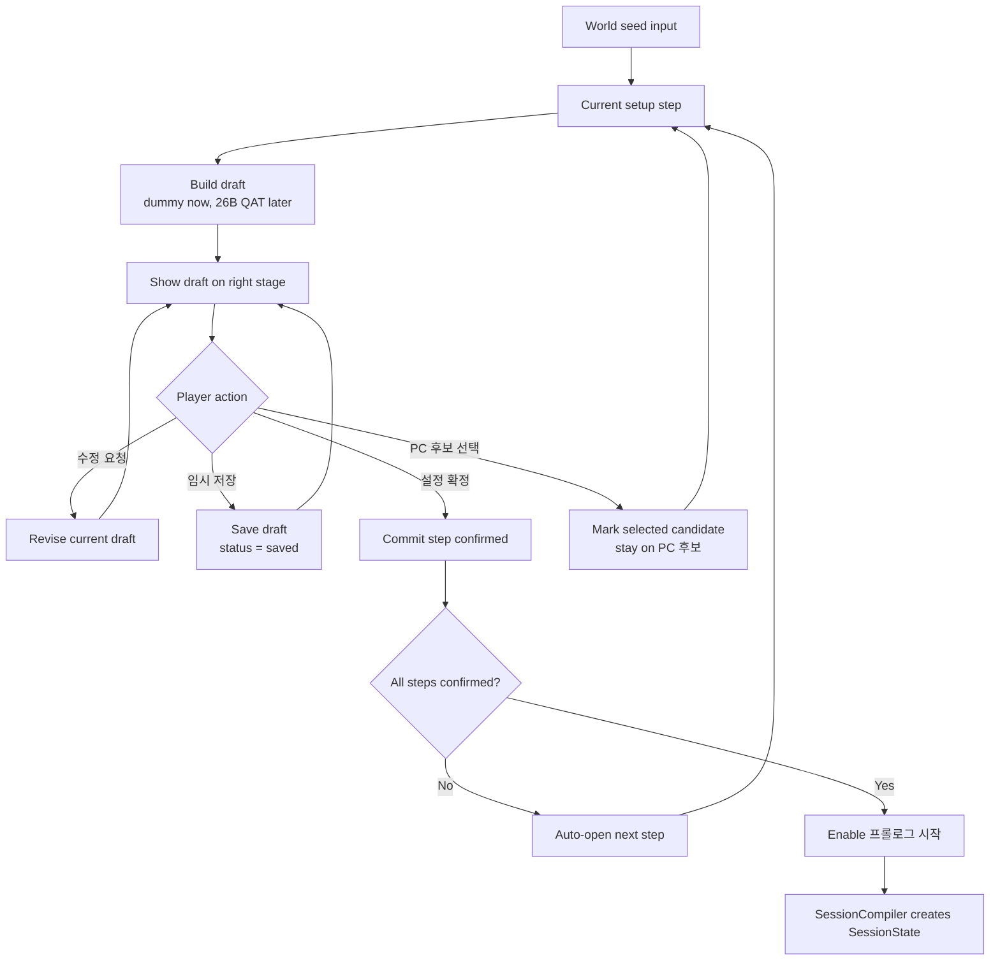
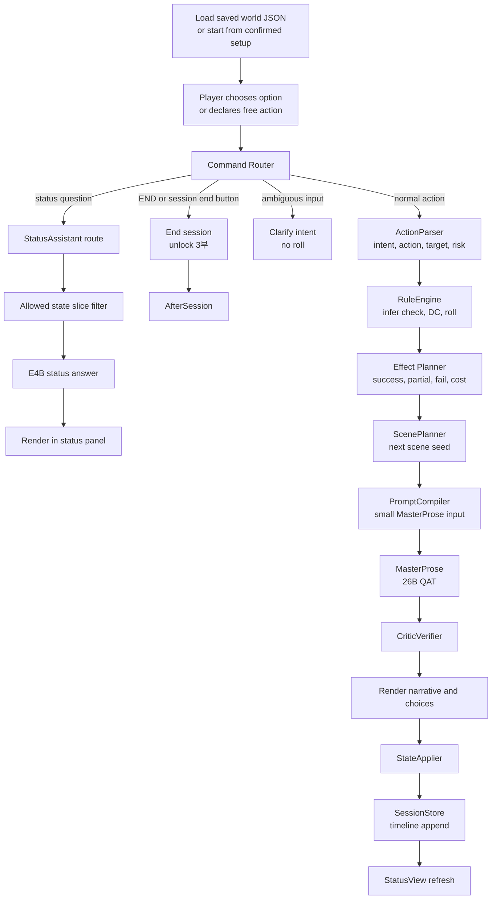
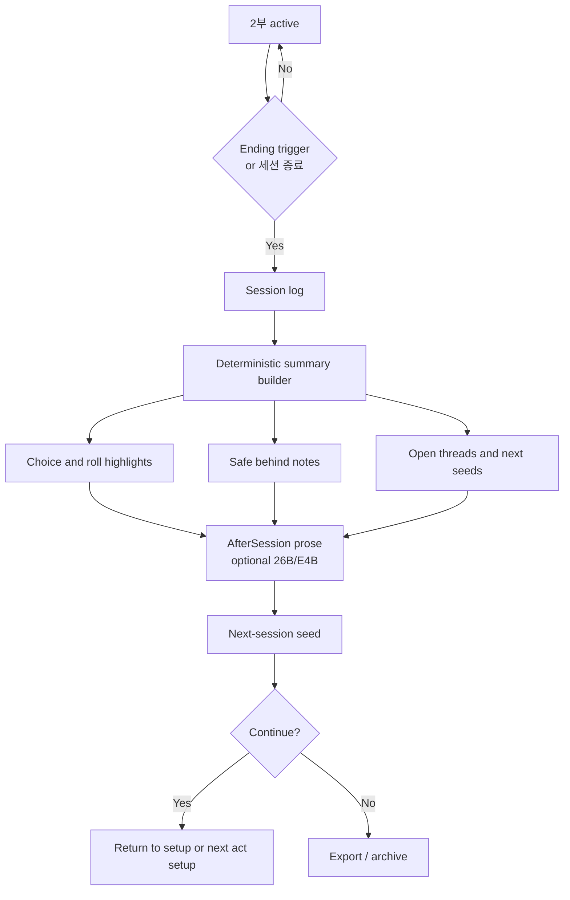

# Winterrain TRPG Architecture Design

Date: 2026-06-05

Source references:

- GPTs prompt references: `prompt/Core.md`, `prompt/Setup.md`, `prompt/StatusView.md`, `prompt/Ending.md`
- Benchmark designs:
  - `design/text-rpg-mystery-master-generation-benchmark-design.md`
  - `design/text-rpg-detective-reveal-scene-benchmark-design.md`

Current implementation decision:

```text
USE_26B_QAT_AS_DEFAULT_ENGINE
USE_E4B_AS_ASSISTANT_ENGINE
DISCARD_12B_FOR_RUNTIME_ENGINE
PROMPT_DIR_IS_REFERENCE_ONLY
```

`prompt/` is GPTs-oriented reference material and is intentionally ignored by git. The webapp should translate those contracts into app modules instead of depending on prompt files at runtime.

## Product Shape

Winterrain TRPG is not a freeform AI chat RP tool. It is a webapp for preparing, playing, and reviewing a single-player TRPG session.

The session has three parts:

```text
1부 세계 생성
2부 세션 플레이
3부 애프터 세션
```

Core product principle:

```text
장르는 플레이 규칙을 정하고, 세계관은 그 규칙에 감정과 몰입을 입힌다.
```

The user does not merely enter a setting. In 1부, the user and AI master co-create the small session rulebook: genre, world frame, play promises, PC, goals, NPCs, and prologue seed. In 2부, the app runs the game loop. In 3부, the app turns the session log into meaning and next-session material.

## Why This Is Not One Giant Prompt

The old ChatGPT Project prompt set works as a monolithic play contract, but a local webapp needs stricter ownership boundaries.

- Deterministic app code owns canonical state, rolls, effects, validation, logs, persistence, and export.
- Local models draft setup material and write player-facing prose.
- Model output never directly mutates canonical game state.
- Long prompt blocks should become small step-specific prompt contracts.
- Setup drafts remain drafts until the user confirms them.

## High-Level Flow


## Core Modules

| Module | Owner | Model? | Role |
| --- | --- | ---: | --- |
| `SetupWizard` | App + LLM | Yes | 1부 단계 진행, draft/confirmed 분리, 수정 요청 반영 |
| `SetupPromptCompiler` | App | No | `Setup.md` 계약을 단계별 작은 prompt로 변환 |
| `SetupStateStore` | App | No | seed, step draft, confirmed step, revision history 저장 |
| `SessionCompiler` | App | No | confirmed setup만 `SessionState`로 변환 |
| `SessionStore` | App | No | 세션 JSON, 턴 로그, world changes 저장 |
| `CommandRouter` | App | No | 상태 질문, 저장/로드, 세션 종료, 일반 행동, 애매한 입력 분기 |
| `ActionParser` | App + optional LLM | Optional | 자유 입력을 작은 행동 계약으로 해석 |
| `RuleEngine` | App | No | 판정, DC, 피로/사기, 목표 진행, 엔딩 조건 |
| `ScenePlanner` | App + optional LLM | Optional | 다음 장면 seed, required/forbidden beats 생성 |
| `MasterProse` | 26B QAT | Yes | 플레이어용 장면 산문 생성 |
| `StatusView` | App | No | 상태창 deterministic 렌더링 |
| `StatusAssistant` | E4B | Yes | 허용된 상태 slice 안에서 질문 답변 |
| `StateApplier` | App | No | effects와 선택 결과를 canonical state에 반영 |
| `CriticVerifier` | App + optional model | Optional | POV, hidden truth, forced resolution, state mutation claim 검증 |
| `AfterSession` | App + optional LLM | Optional | 로그 기반 회고, 약속 카드 검토, 다음 seed 제안 |

## Data Model

Two states must stay separate.

### SetupState

`SetupState` is not the game state. It is a draft workspace for 1부.

```json
{
  "seed": "",
  "currentStep": "worldFrame",
  "steps": {
    "worldFrame": {
      "status": "drafted",
      "draft": {},
      "confirmed": null,
      "stale": false,
      "dependsOn": [],
      "revisionHistory": []
    },
    "worldContext": {
      "status": "locked",
      "draft": {},
      "confirmed": null,
      "stale": false,
      "dependsOn": ["worldFrame"],
      "revisionHistory": []
    },
    "pcCandidates": {
      "status": "locked",
      "draft": {},
      "confirmed": null,
      "selectedIndex": null,
      "stale": false,
      "dependsOn": ["worldFrame", "worldContext"],
      "revisionHistory": []
    },
    "characterDetail": {
      "status": "locked",
      "draft": {},
      "confirmed": null,
      "stale": false,
      "dependsOn": ["pcCandidates"],
      "revisionHistory": []
    },
    "sessionRules": {
      "status": "locked",
      "draft": {},
      "confirmed": null,
      "stale": false,
      "dependsOn": ["worldFrame", "worldContext", "characterDetail"],
      "revisionHistory": []
    },
    "prologue": {
      "status": "locked",
      "draft": {},
      "confirmed": null,
      "stale": false,
      "dependsOn": ["worldFrame", "worldContext", "characterDetail", "sessionRules"],
      "revisionHistory": []
    }
  }
}
```

`currentStep` enum:

```text
worldFrame
worldContext
pcCandidates
characterDetail
sessionRules
prologue
```

Step status:

```text
locked
drafted
saved
confirmed
```

Rules:

- `draft` may be regenerated or revised freely.
- `saved` preserves a work-in-progress draft but does not commit it to canonical setup.
- `confirmed` is the only value used by `SessionCompiler`.
- `stale` is separate from status. A confirmed step can remain confirmed but stale after an earlier dependency changes.
- `프롤로그 시작` must stay disabled while any required confirmed step is stale.
- Before prologue starts, the user must approve saving the compiled setup as `[캐릭터명]-[날짜]-[장르].json`.
- The saved JSON is the canonical base for play; LLM output can propose prose or effects but cannot mutate this file by claim.
- The user can go backward to revise a confirmed step. Dependent later steps should show stale warning badges until re-confirmed.

### SessionState

`SessionState` begins only after 1부 is confirmed and prologue starts.

```json
{
  "saveMeta": {
    "id": "",
    "createdAt": "",
    "updatedAt": "",
    "displayTitle": "",
    "phase": "setup_ready",
    "turn": 1,
    "playerName": "",
    "genre": "",
    "lastSceneTitle": "",
    "lastPlayedAt": null
  },
  "world": {
    "genre": "",
    "techLevel": "",
    "referenceWorld": "",
    "tone": "",
    "coreConflict": "",
    "promiseCard": {
      "type": "",
      "toggles": {},
      "promises": []
    },
    "context": ""
  },
  "rules": {
    "source": ["prompt/Core.md", "prompt/Setup.md", "prompt/StatusView.md"],
    "checks": {
      "formula": "1D20 + player.mods[ability] >= DC",
      "dcRange": {"min": 10, "max": 22},
      "difficultyMode": "보통",
      "easyMode": {
        "partialSuccessBias": true,
        "preserveCoreClues": true
      },
      "resolutionOrder": ["criticalFailure", "criticalSuccess", "success", "partialSuccess", "failure"],
      "activeResultBands": [],
      "resultBandsByDifficulty": {
        "쉬움": [
          {"key": "criticalSuccess", "condition": "natural20 or total >= dc + 5"},
          {"key": "success", "condition": "total >= dc"},
          {"key": "partialSuccess", "condition": "dc - 4 <= total < dc"},
          {"key": "failure", "condition": "dc - 8 <= total <= dc - 5"},
          {"key": "criticalFailure", "condition": "natural1 or total <= dc - 9"}
        ],
        "보통": [
          {"key": "criticalSuccess", "condition": "natural20 or total >= dc + 5"},
          {"key": "success", "condition": "total >= dc"},
          {"key": "partialSuccess", "condition": "dc - 2 <= total < dc"},
          {"key": "failure", "condition": "dc - 7 <= total <= dc - 3"},
          {"key": "criticalFailure", "condition": "natural1 or total <= dc - 8"}
        ],
        "어려움": [
          {"key": "criticalSuccess", "condition": "natural20 and total >= dc or total >= dc + 7"},
          {"key": "success", "condition": "total >= dc"},
          {"key": "partialSuccess", "condition": "total == dc - 1"},
          {"key": "failure", "condition": "dc - 6 <= total <= dc - 2"},
          {"key": "criticalFailure", "condition": "natural1 or total <= dc - 7"}
        ]
      },
      "dcGuidelines": []
    },
    "status": {
      "hp": {
        "range": [0, 100],
        "default": 70,
        "deathAt": 0,
        "bands": [
          {"label": "위험", "range": [0, 20], "modifier": -2, "appliesTo": "allChecks"},
          {"label": "중상", "range": [21, 40], "modifier": -1, "appliesTo": "physicalChecks"},
          {"label": "불편", "range": [41, 60], "modifier": 0, "appliesTo": "fictionOnly"},
          {"label": "양호", "range": [61, 80], "modifier": 0, "appliesTo": "allChecks"},
          {"label": "건재", "range": [81, 100], "modifier": 1, "appliesTo": "physicalChecks"}
        ]
      },
      "fatigue": {
        "range": [0, 20],
        "startingRange": [8, 12],
        "bands": [
          {"label": "상쾌", "range": [0, 3], "modifier": 1, "appliesTo": "allChecks"},
          {"label": "보통", "range": [4, 8], "modifier": 0, "appliesTo": "allChecks"},
          {"label": "피곤", "range": [9, 13], "modifier": 0, "appliesTo": "fictionOnly"},
          {"label": "탈진 직전", "range": [14, 17], "modifier": -1, "appliesTo": "allChecks"},
          {"label": "한계", "range": [18, 20], "modifier": -2, "appliesTo": "allChecks", "hardModeTurnEndHpLoss": 5}
        ],
        "recovery": {}
      },
      "morale": {
        "range": [0, 100],
        "default": 60,
        "startingRange": [50, 70],
        "bands": [
          {"label": "무너짐", "range": [0, 20], "modifier": -2, "appliesTo": "socialAndRiskChecks"},
          {"label": "위축", "range": [21, 40], "modifier": -1, "appliesTo": "socialAndRiskChecks"},
          {"label": "보통", "range": [41, 60], "modifier": 0, "appliesTo": "allChecks"},
          {"label": "의욕", "range": [61, 80], "modifier": 0, "appliesTo": "fictionOnly"},
          {"label": "고양", "range": [81, 100], "modifier": 1, "appliesTo": "socialAndGoalChecks"}
        ],
        "gain": {},
        "loss": {}
      }
    },
    "goals": {
      "shortGoalCompleteWhen": "player.goals.progress.shortPercent == 100",
      "mainGoalCompleteWhen": "player.goals.progress.mainComplete == true"
    },
    "narrationConstraints": {
      "hideNumbersInFiction": true,
      "allowedNumericSurfaces": ["rollBlock", "statusSummary", "statusView"],
      "turnOneSkipsRollBlock": true
    }
  },
  "player": {
    "name": "",
    "gender": "",
    "age": "",
    "background": "",
    "values": [],
    "traits": {"strengths": [], "flaws": []},
    "abilityTags": {"strong": [], "flaw": []},
    "abilityLinks": [],
    "abilities": {"STR": 0, "DEX": 0, "CON": 0, "INT": 0, "WIS": 0, "CHA": 0},
    "mods": {"STR": 0, "DEX": 0, "CON": 0, "INT": 0, "WIS": 0, "CHA": 0},
    "initialStatus": {"hp": 70, "fatigue": 10, "morale": 60},
    "status": {"hp": 70, "fatigue": 10, "morale": 60},
    "goals": {
      "main": "",
      "short": "",
      "mainComplete": false,
      "progress": {"shortPercent": 0, "completedShort": [], "globalPercent": 0}
    },
    "speech": ""
  },
  "npcs": [
    {
      "name": "",
      "role": "",
      "relationTags": "",
      "speechToPc": "",
      "initialRelationshipScore": 0,
      "relationshipScore": 0,
      "currentStatus": "",
      "lastSeen": "",
      "flags": []
    }
  ],
  "masterOnly": {
    "truthLocked": false,
    "truth": {
      "culprit": "",
      "motive": "",
      "method": "",
      "timeline": [],
      "lockedFacts": []
    },
    "clues": [],
    "redHerrings": []
  },
  "prologue": {
    "sceneTitle": "",
    "date": "",
    "time": "",
    "place": "",
    "summary": ""
  },
  "runtime": {
    "phase": "setup_ready",
    "turn": 1,
    "currentDate": "",
    "currentTime": "",
    "currentPlace": "",
    "currentSceneTitle": "",
    "lastPlayedAt": null
  },
  "session": {
    "knownFacts": [],
    "recentChange": "세션 준비 중",
    "log": []
  },
  "timeline": [],
  "summary": {
    "daysPassed": 0,
    "turnsTotal": 0,
    "npcCount": 0,
    "worldChanges": []
  }
}
```

### Ability Generation

능력치는 PC 후보를 선택한 뒤 `④ 캐릭터 상세` 단계에서 앱이 생성한다. 모델은 강점/결함 후보를 제안할 수 있지만, 최종 능력치와 보정치 계산은 앱이 deterministic하게 수행한다. 결과는 `player.abilities`와 `player.mods`에 분리 기록한다.

Trait linkage:

- `player.traits.strengths/flaws` are player-facing character traits.
- `player.abilityTags.strong/flaw` are deterministic rule tags used by ability generation.
- Traits and ability tags do not need to be perfectly identical, but every ability tag must have a readable trait link.
- Example links: `손재주 -> DEX`, `서툰 손놀림 -> DEX flaw`, `기억력 -> INT`, `눈썰미 -> WIS`, `친화력 -> CHA`, `체력이 약함 -> CON flaw`.
- If a trait can reasonably pull in opposite directions, the same ability may appear in both `strong` and `flaw`; the conflict rule below resolves it with `1D6`.
- The app stores the final link rationale as `player.abilityLinks[]` so the UI can explain why a trait affected a specific ability.
- The model may draft trait text and suggested ability links, but the app validates that ability IDs are one of `STR/DEX/CON/INT/WIS/CHA` and that strong/flaw tags are each capped at two.

Abilities:

```text
STR / DEX / CON / INT / WIS / CHA
```

Generation order:

1. 기본값 생성
   - 결함이 없는 능력치: `rand(8, 12)`
   - 결함이 붙은 능력치: `rand(9, 12)`
   - 결함 능력치의 하한은 9다. `-3` 적용 뒤 최솟값이 6이 되어 보정치가 `-2`에 수렴하게 하기 위함이다.
2. 강점/결함 반영
   - 강점과 결함은 각각 최대 2개까지 지정할 수 있다.
   - 같은 능력치에 강점과 결함이 동시에 붙을 수 있다.
   - 강점만 있는 능력치: `+3`
   - 결함만 있는 능력치: `-3`
   - 강점과 결함이 모두 있는 능력치: `1D6`; 4 이상이면 `+1`, 3 이하이면 `-1`
3. 보정치 계산
   - `mod = floor((ability - 10) / 2)`
   - `player.mods.STR` 등 각 키에 기록한다.
4. 균형 검사 및 조정
   - 양수 보정 존재: `mod > 0`인 능력치가 1개 이상
   - 음수 보정 존재: `mod < 0`인 능력치가 1개 이상
   - 양수 보정 합 상한: `sum(max(mod, 0)) <= 4`
   - 음수 보정 합 하한: `sum(min(mod, 0)) >= -4`

Adjustment rules:

- 강점/결함이 붙은 능력치는 조정 대상에서 제외한다.
- 양수 합 초과 시, 보정치가 양수인 중립 능력치 중 가장 낮은 것부터 점수를 `-1`씩 조정한다.
- 음수 합 초과 시, 보정치가 음수인 중립 능력치 중 가장 높은 것부터 점수를 `+1`씩 조정한다.
- 중립 능력치가 모두 소진되어도 조건을 충족하지 못하면 앱은 경고를 표시하고 현재 상태로 확정할 수 있다.

Example:

| Ability | Base | Tag adjustment | Final | Mod |
| --- | ---: | ---: | ---: | ---: |
| STR | 10 | 0 | 10 | +0 |
| DEX | 11 | 0 | 11 | +0 |
| CON | 11 | -3 | 8 | -1 |
| INT | 9 | +3 | 12 | +1 |
| WIS | 8 | 0 | 8 | -1 |
| CHA | 10 | 0 | 10 | +0 |

For this example, `positiveSum = +1` and `negativeSum = -2`, so the balance check passes.

### Status Five-Step Bands

건강, 피로, 사기는 모두 앱이 deterministic하게 관리한다. 모델은 상태 수치를 새로 정하거나 변경했다고 선언할 수 없고, 상태 변화는 `RuleEngine`과 `StateApplier`가 검증한 결과만 `player.status`에 반영한다.

각 상태는 5단계 band를 가진다. UI는 현재 수치와 함께 band 이름을 표시하고, fiction prose는 이 band를 넘는 과장된 표현을 만들지 않도록 참조한다.

Health / `hp`:

| Stage | Range | Rule |
| --- | ---: | --- |
| 위험 | 0-20 | 생존이 우선이다. `hp == 0`이면 자동 사망하고 Ending 모듈로 이동한다. |
| 중상 | 21-40 | 이동, 저항, 힘쓰기가 불리하다. 물리 판정에 `-1`을 적용할 수 있다. |
| 불편 | 41-60 | 활동은 가능하지만 무리하면 피로와 추가 부상 위험이 커진다. |
| 양호 | 61-80 | 일상/모험 장면을 안정적으로 수행할 수 있다. |
| 건재 | 81-100 | 몸 상태가 좋아 이동, 버티기, 힘쓰기에 여유가 있다. 물리 판정에 `+1`을 적용할 수 있다. |

Fatigue / `fatigue`:

| Stage | Range | Rule |
| --- | ---: | --- |
| 상쾌 | 0-3 | 휴식이 충분하다. 전 판정에 `+1`을 적용할 수 있다. |
| 보통 | 4-8 | 누적 부담이 낮다. 별도 보정은 없다. |
| 피곤 | 9-13 | 아직 움직일 수 있지만 장면 비용으로 피로가 쌓이기 쉽다. |
| 탈진 직전 | 14-17 | 집중과 판단이 흐려진다. 전 판정에 `-1`을 적용할 수 있다. |
| 한계 | 18-20 | 전 판정에 `-2`를 적용할 수 있다. `difficultyMode == "어려움"`이면 턴 종료 시 건강 `-5`가 발생한다. |

Morale / `morale`:

| Stage | Range | Rule |
| --- | ---: | --- |
| 무너짐 | 0-20 | 포기, 공포, 충동적 선택의 압력이 강하다. 사회/위험 감수 판정에 `-2`를 적용할 수 있다. |
| 위축 | 21-40 | 설득, 협상, 위험 감수 판단이 불리하다. 사회/위험 감수 판정에 `-1`을 적용할 수 있다. |
| 보통 | 41-60 | 불안과 의욕이 균형을 이룬다. 별도 보정은 없다. |
| 의욕 | 61-80 | 움직일 마음은 있지만 무모한 고양 상태는 아니다. fiction tone만 밝아진다. |
| 고양 | 81-100 | 목표 추진, 설득, 격려 장면에 여유가 생긴다. 사회/목표 판정에 `+1`을 적용할 수 있다. |

Status influence in 2부 turn resolution:

```text
자유 행동 입력
→ LLM/App: 의도 + 행동 + 대상 + 접근 방식 + 위험도 해석
→ App: sceneDC 산정
   - baseDC: 행동 자체의 어려움
   - npcRelationDC: 대상 NPC와의 관계치
   - npcTagDC: NPC 성향/역할 태그
   - scenePressureDC: 플롯/시간/장소 압력
→ App: statusModifier 산정
   - 건강: 신체, 이동, 버티기, 힘쓰기 계열
   - 피로: 누적 부담. 특히 장기 행동과 전반 판정에 영향
   - 사기: 설득, 협상, 위험 감수, 목표 추진에 영향
→ App: d20 + abilityMod + statusModifier vs sceneDC
→ App: result band 확정
→ App: state delta 확정
→ MasterProse: scene context + action intent + result band + NPC reaction seed + state delta
```

DC and player condition must remain separate in logs. `sceneDC = baseDC + npcRelationDC + npcTagDC + scenePressureDC` represents the objective scene difficulty. `rollTotal = d20 + abilityMod + statusModifier` represents the PC's current ability to perform under that condition. NPC relationship and NPC tags affect `sceneDC`, not `abilityMod` or `statusModifier`.

Status role boundaries:

- `morale` makes play harder or easier through social, risk, and goal-push modifiers. It is not a direct game-over condition.
- `fatigue` represents accumulated burden. In `difficultyMode == "어려움"`, fatigue stage `한계` applies `hp -5` at turn end.
- `hp` is the hard survival line. `hp <= 0` immediately triggers game over and routes to the Ending module.
- The model may describe the felt pressure of low morale or high fatigue, but only the app may calculate modifiers, health loss, or game-over transitions.

### NPC Network Rules

`④ 캐릭터 상세` must create an initial NPC network that can support play pressure without forcing a villain. The default term is `마찰 NPC`, not enemy NPC.

Speech fields:

- `player.speech` means how the PC normally speaks when the player-facing prose includes PC dialogue or paraphrased PC expression.
- `npc.speechToPc` means how that NPC speaks to the PC.
- NPC speech style is not how the PC speaks to that NPC. The PC's address style is inferred from `player.speech`, relationship context, and the player's declared action.
- Legacy exports may contain `npc.speech`; treat it as an alias of `npc.speechToPc` during load.

Core rules:

- The initial NPC network should include at least three major NPCs.
- At least one major NPC must be a `마찰 NPC`.
- In 생활/모험, a friction NPC usually has `relationshipScore` around `-5` to `-12`.
- The friction reason should prefer goal conflict, misunderstanding, responsibility, scarce resources, schedule pressure, or different priorities over malice or violence.
- A friction NPC must remain persuadable, negotiable, or capable of relationship change unless the genre contract says otherwise.
- The app records the friction as tags and relationship score; the model may portray tone and reaction, but cannot secretly turn a friction NPC into a hidden culprit or hard antagonist without genre support.

Genre-specific interpretation:

| Genre | Friction NPC role |
| --- | --- |
| 생활/모험 | Non-villain obstacle, skeptical helper, overworked coordinator, rival, rule-bound gatekeeper. |
| 추리/수사 | May become a suspect, unreliable witness, obstructive official, or later antagonist candidate, but truth-lock rules decide actual guilt. |
| 정치 | May become an opposing faction actor, leverage holder, public rival, or active adversary if faction state supports it. |
| 전쟁 | The NPC network must include allied NPCs and enemy NPCs. At least one allied NPC should also be a friction NPC through command conflict, supply priority, morale pressure, field judgment, or competing mission priorities. |

### SessionCompiler Mapping

`SessionCompiler` reads confirmed setup values only. It does not read `draft` values and must refuse or warn if any required confirmed step is stale.

| Setup step | SessionState target | Rule |
| --- | --- | --- |
| `worldFrame` | `world.genre`, `world.era`, `world.referenceWorld`, `world.tone`, `world.coreConflict` | ① 세계 골격 supplies the stable frame. |
| `worldContext` | `world.context` | ② 세계 맥락 is stored as context. It must not be silently merged into `world.coreConflict`. |
| `pcCandidates` | `source.selectedCandidate`, `player` seed reference | Only the selected candidate metadata is carried forward. Unselected candidates remain setup history, not runtime state. |
| `characterDetail` | `player`, `player.abilities`, `player.mods`, `player.initialStatus`, `player.status`, `npcs` | App-generated abilities/mods and confirmed NPC relationship network become canonical. |
| `sessionRules` | `world.promiseCard`, `rules.checks.difficultyMode`, `rules.checks.activeResultBands`, game-over rules | ⑤ locks long-term goal, genre promises, play difficulty, and ending conditions. |
| `prologue` | `player.goals.shortTerm`, `prologue`, `runtime.currentDate`, `runtime.currentTime`, `runtime.currentPlace`, `runtime.currentSceneTitle`, initial `session.knownFacts` | ⑥ creates the first playable scene and short-term goal. |

Short-term goal rule:

- `⑥ 프롤로그` proposes the initial short-term goal from the confirmed long-term goal, selected PC, and first scene pressure.
- The player may revise this value before confirming the prologue.
- The confirmed value is stored as `player.goals.shortTerm` and is used by the first 2부 status view.

Compatibility note:

- Internal names can be readable webapp names.
- When needed, adapters can compile to old `wf/ps/np/tl/su` prompt shapes.
- The old GPTs prompt schema is reference material, not the runtime storage format.
- `session.knownFacts` is not a log of every event. It stores only concise facts the PC has actually noticed, and the status view should render only the latest five.
- `session.recentChange` is separate from known facts. It summarizes the latest action/result or save/load/session event.
- `runtime.currentDate`, `runtime.currentTime`, `runtime.currentPlace`, and `runtime.currentSceneTitle` are required for 2부 loading and turn header rendering.

## 1부 세계 생성 UX

1부 is a session-zero style wizard. The player should feel that the session is being shaped with an AI master, not that a static setup form is being filled.

Initial implementation is single-session first. 1부 starts from a fresh seed, compiles one playable `SessionState`, and hands that state to 2부.

Future campaign continuation should remain possible by design. In that mode, 1부 becomes `다음 세션 준비`: it can reference a previous world/session run/after-session seed, then ask the player which elements carry forward before compiling a new `SessionState`.

Future setup mode shape:

```json
{
  "setupMode": "newWorld | continueWorld",
  "carryover": {
    "sourceWorldId": "",
    "sourceRunId": "",
    "sourceAfterSessionId": "",
    "keptPc": true,
    "keptNpcs": [],
    "knownFactsCarried": [],
    "openThreadsCarried": [],
    "relationshipChangesCarried": [],
    "nextSessionSeed": "",
    "archivedFacts": []
  }
}
```

Carryover is reference material until confirmed. The app must not silently copy the entire previous session into the next one. The player should confirm kept PC, kept NPCs, carried known facts, unresolved threads, relationship changes, and the next-session seed. `SessionCompiler` then creates a fresh `SessionState` for the next run.

The first implementation may keep `setupMode = "newWorld"` only, as long as saved data keeps enough IDs, NPC state, known facts, open threads, and after-session seeds to make `continueWorld` possible later.

Current shell layout:

```text
left rail:
  world seed
  [세계 seed 적용]
  ① 세계 골격
  ② 세계 맥락
  ③ PC 후보
  ④ 캐릭터 상세
  ⑤ 세션 규칙
  ⑥ 프롤로그
  [설정 초기화]

center stage:
  current step draft

right control panel:
  request input + [수정 반영]
  right-aligned [임시 저장] [설정 확정]
```

### Setup Steps

| Step | Purpose | Output |
| --- | --- | --- |
| `① 세계 골격` | seed를 장르, 시대, 참조 세계, 톤, 핵심 갈등으로 정리 | `worldFrame` draft |
| `② 세계 맥락` | ① 세계 골격을 보충하는 플레이어용 세계 소개문을 600자 내외로 구체화 | `worldContext` draft |
| `③ PC 후보` | 세계에 맞는 PC 후보 5명 제안 | temporary candidates |
| `④ 캐릭터 상세` | 선택한 PC의 배경, 가치관, PC 말투, 능력치, 보정치, 건강/피로/사기, 핵심 NPC와 NPC별 대PC 말투를 확정 | `player.background`, `player.speech`, `player.abilities`, `player.status`, `npcs` |
| `⑤ 세션 규칙` | 장기 목표, 장르 약속, 난이도, 게임 오버 조건을 프롤로그 직전 확정 | `player.goals.longTerm`, `promiseCard`, `difficulty`, `gameOver` |
| `⑥ 프롤로그` | 이전 단계의 설정 요약을 최종 확인하고, 단기 목표와 첫 장면의 제목, 날짜, 시각, 장소, 상황 압력을 준비 | `setupReview`, `player.goals.shortTerm`, `prologue` |

### Setup Wizard Flow



### Setup Rules

- Setup is allowed to be conversational and revisable.
- `세계 seed 적용` converts the user's seed into the first world frame/context draft and marks setup from `① 세계 골격` as unconfirmed again.
- A revision request updates only the current step draft.
- `임시 저장` preserves the draft but does not make it canonical.
- `설정 확정` copies the draft into confirmed setup state and automatically opens the next step.
- In `③ PC 후보`, choosing a candidate only marks the selected card. `설정 확정` commits the candidate and opens `④ 캐릭터 상세`.
- `PC 다시 선택` is visible only in `④ 캐릭터 상세`, where the user can still naturally reject the selected PC before session rules and prologue are locked.
- `설정 초기화` is a global destructive action in the left rail. It returns setup to `① 세계 골격`, clears unconfirmed setup state, and requires confirmation.
- `④ 캐릭터 상세` owns the player's deeper background, speech style, values, strengths/flaws, six abilities, modifiers, health/fatigue/morale, and the initial relationship network.
- `⑤ 세션 규칙` locks the long-term goal, genre promises, play difficulty, and game-over conditions immediately before prologue.
- `⑤ 세션 규칙` should expose play difficulty as radio choices: `쉬움`, `보통`, `어려움`. Changing the selected difficulty immediately changes the player-facing explanation for result bands, failure cost, intent-confirmation behavior, and status pressure.
- `⑥ 프롤로그` acts as the final pre-play review. It shows a compact setup summary, character summary, NPC summary, and the first scene seed before JSON save/start.
- A confirmed step becomes the source for later prompts.
- The app should expose progress clearly through circled-number navigation and per-step status.
- `프롤로그 시작` should remain disabled until all required setup steps are confirmed.
- When an earlier confirmed step changes, dependent later steps keep their confirmed values but become stale until re-confirmed.

## 2부 세션 플레이 UX

The default rule loop is intentionally simple.

```text
세계 설정 후, 상황이 제시된다
-> 선택지를 고르거나 직접 행동을 만든다
-> 행동의 결과를 주사위로 판정한다
-> 판정을 반영하여 다음 상황을 만든다
```

The webapp should show the main play panel and status panel together.

```text
main play panel:
  loaded world / PC / turn header
  scene title
  save / world load / session end actions
  date-time-place block
  narrative
  roll result
  choices
  free action input

status panel:
  HP / fatigue / morale
  current goal
  latest five PC-known facts
  recent change as separate event summary
  allowed status Q&A
```

2부 can start in either of two ways:

1. Continue directly from 1부 after saving the compiled setup JSON.
2. Load a previously saved world JSON from `data/worlds/`.

The current local server exposes:

| Route | Role |
| --- | --- |
| `POST /api/worlds` | Save compiled world/session JSON under `data/worlds/`, preserving unique filenames. |
| `GET /api/worlds` | Return loadable world summaries: title, PC, genre, phase, turn, and last scene. |
| `GET /api/worlds/{fileName}` | Load a selected world JSON into 2부. |

### Turn Pipeline



Rules:

- Roll and effects are decided before prose generation.
- Prose sees `roll_result`, but cannot override it.
- General free input must pass through `ActionParser` before `RuleEngine`.
- Ambiguous input asks for clarification instead of guessing an action and rolling.
- `MasterProse` returns visible text, choices, and short summary.
- World/NPC change candidates are suggestions only and must be validated.
- The app writes canonical state and timeline.
- The play header displays current loaded world, PC name, turn number, scene title, date, time, and place from canonical state.
- `세계 로드` must replace the current play state from JSON rather than asking the model to reconstruct it.
- `세션 종료` unlocks 3부 and moves the player to after-session review. Starting or loading a session locks 3부 again.

### Action Interpretation Contract

Player input is stored as raw text, then interpreted into a small action contract before deterministic resolution. This is required for 2부 to reach meaningful endings: goal progress, relationship change, fatigue/morale cost, known facts, and ending gates all depend on a stable interpretation of what the player tried to do.

```json
{
  "rawInput": "",
  "route": "normal_action | status_question | save_load | end_session | clarify",
  "intent": "",
  "action": "",
  "target": "",
  "approach": "",
  "risk": "low | medium | high",
  "actionType": "investigate | talk | move | help | craft | rest | confront | other",
  "suggestedAbility": "STR | DEX | CON | INT | WIS | CHA | none",
  "declarationQuality": "weak | normal | strong",
  "riskControl": "none | implied | explicit",
  "needsClarification": false,
  "clarificationQuestion": "",
  "interpretationReason": ""
}
```

Field meanings:

- `route`: whether the input should continue to normal resolution or be handled by another deterministic path.
- `intent`: what the player wants to change or learn.
- `action`: what the PC actually attempts.
- `target`: the main NPC, place, object, route, or problem being acted on.
- `approach`: tone or method, such as polite, forceful, cautious, stealthy, direct, or improvised.
- `risk`: likely exposure, cost, danger, or social pressure if the attempt goes poorly.
- `actionType`: broad action family used by `RuleEngine`, `EffectPlanner`, and ending gates.
- `suggestedAbility`: parser hint only; `RuleEngine` may override it.
- `declarationQuality`: how precise the declaration is as a tactical action.
- `riskControl`: whether the player explicitly described order, caution, distance, or other risk-control behavior.
- `needsClarification`: true when the player intent is too vague, contradictory, or would force the app to invent the PC's choice.
- `interpretationReason`: short explanation of why the parser read the input this way. Store it in logs; show it in normal UI only when needed.

The first implementation can use deterministic rules plus an E4B fallback. A future small function-calling model can be evaluated for this role, but it must be treated as an `ActionParser` candidate, not as a master prose model.

The parser may be model-assisted, but the app validates and normalizes the result before using it. The parsed action can affect ability selection, effect planning, and ending gates. `RuleEngine` owns final DC, `sceneDC` reasons, `rollTotal`, and result bands.

The parser must not:

- roll dice, choose final DC, or decide success.
- mutate canonical state or claim that state has changed.
- reveal hidden truth, infer unearned facts, or decide the player's conclusion.
- silently convert ambiguous input into a risky action.
- invent agency-critical intent such as betrayal, confession, attack intent, surrender, romantic commitment, self-harm, murder, final deduction, or irreversible sacrifice.

### ScenePlanner Contract

`ScenePlanner` receives the resolved turn and prepares the next scene seed. It does not write player-facing prose and does not mutate canonical state.

Resolved turn logs should include AfterSession signals so 3부 can later choose highlights from app-owned evidence instead of asking the model to invent them.

These signals are not final highlight decisions. Some turns only become important after later consequences make their meaning visible. 2부 records immediate observations and provisional hints; 3부 retrospectively resolves highlights after reading the whole `turnLog`, `timeline`, and final state.

```json
{
  "afterSessionSignals": {
    "choiceImpact": 0,
    "declarationPrecision": 0,
    "riskControl": 0,
    "rollSwing": 0,
    "relationshipImpact": 0,
    "goalImpact": 0,
    "costSeverity": 0,
    "sceneDrama": 0,
    "genreFit": 0
  },
  "highlightHints": [
    "precise_declaration",
    "risk_control",
    "large_roll_swing"
  ],
  "resolvedHighlights": []
}
```

Signal values are app-assigned scores, not prose claims. They can be coarse integers such as `0-3` in the first implementation. `highlightHints` marks why a turn may be worth revisiting, while `resolvedHighlights` stays empty during 2부 and is filled by the 3부 summary builder.

```text
2부 records signals.
3부 judges meaning from the full session context.
The model writes reflective prose from resolved evidence.
```

Input:

```json
{
  "currentScene": {
    "title": "",
    "date": "",
    "time": "",
    "place": "",
    "situation": "",
    "activePressure": "",
    "knownFacts": []
  },
  "playerAction": {
    "rawInput": "",
    "intent": "",
    "action": "",
    "target": "",
    "approach": "",
    "risk": "low | medium | high"
  },
  "resolution": {
    "ability": "",
    "sceneDC": 0,
    "dcReasons": [],
    "rollTotal": 0,
    "resultBand": "",
    "successLabel": ""
  },
  "stateDelta": {
    "hp": 0,
    "fatigue": 0,
    "morale": 0,
    "relationshipChanges": [],
    "knownFactsAdded": [],
    "goalProgress": 0
  },
  "npcReaction": {
    "npcId": "",
    "stanceBefore": "",
    "reactionSeed": "",
    "stanceAfter": ""
  },
  "constraints": {
    "genre": "",
    "promiseCard": [],
    "forbiddenBeats": [],
    "mustNotResolve": []
  }
}
```

Output:

```json
{
  "nextScene": {
    "title": "",
    "date": "",
    "time": "",
    "place": "",
    "situationSeed": "",
    "activePressure": "",
    "entryBeat": ""
  },
  "continuity": {
    "carriedFacts": [],
    "visibleConsequences": [],
    "npcPositions": [],
    "openThreads": []
  },
  "playerFacing": {
    "requiredBeats": [],
    "suggestedChoices": ["", "", ""],
    "freeActionEncouraged": true,
    "shortSummary": ""
  },
  "stateCandidates": {
    "knownFactsToConfirm": [],
    "worldChangesToValidate": [],
    "npcChangesToValidate": []
  }
}
```

`suggestedChoices` must contain exactly three example actions, each no longer than 20 Korean characters. They are not the only legal moves; free input remains the primary play path. `requiredBeats`, `openThreads`, and `activePressure` are the main bridge from deterministic resolution to `MasterProse`.

## Status Panel

Status is a play aid, not a second master.

Role:

```text
현재 상태 제시 + 게임 허용 범위 안에서 유저 질문에 답변
```

Allowed:

- summarize canonical state
- explain only PC-known information
- answer questions about HP, fatigue, morale, goals, known clues, NPC relationships, and recent logs
- restate available options without choosing for the player

Forbidden:

- reveal hidden truth
- infer undiscovered clues
- recommend the single correct action
- progress the scene
- mutate state

Routing:

| Surface | Owner | Model route |
| --- | --- | --- |
| Main play prose | `MasterProse` | 26B QAT default engine |
| Status rendering | App | deterministic |
| Status Q&A | `StatusAssistant` | E4B is sufficient |
| State changes | `StateApplier` | app only |

Current status rendering contract:

- `knownFacts`: latest five concise facts the PC has actually noticed.
- `recentChange`: latest visible action/result, save/load marker, or session-end marker.
- Do not store short-term goals, prologue readiness, roll math, or general system events as known facts.
- If no PC-known facts exist, render an empty-state message instead of inventing information.
- A resolved turn may produce `knownFactsAdded`, but only from facts the PC actually saw, heard, inferred from direct evidence, or had confirmed in-fiction.
- `knownFactsAdded` must not include hidden truth, unsupported deduction, system/DC reasons, or full turn-log narration.
- `StateApplier` validates `knownFactsAdded`, appends accepted facts to `session.knownFacts`, and stores the same accepted list in `turnLog.knownFactsAdded`.

## 3부 애프터 세션

After session is part of play. It is where the player sees what the session meant and what can continue.

3부 must remain disabled until 2부 is explicitly ended. The tab is locked during setup, during a loaded/active session, and after restarting or loading another session. It unlocks only when the session reaches an ending trigger or the player presses `세션 종료`.

After session should summarize:

- important choices
- roll outcomes and durable consequences
- goal progress
- NPC and faction changes
- world changes
- promise-card fit
- next-session seeds

After-session review should feel like a table talk after the game, not a generic report. It should help the player understand what their choices meant, what the session could have become, and what remains alive for the next session.

Recommended review sections:

1. `세션 요약`: short grounded recap of the session arc.
2. `베스트 선택`: the player choice that created the strongest positive turn, relationship beat, discovery, or recovery.
3. `워스트 선택 / 가장 비용이 컸던 선택`: the choice with the largest cost, without shaming the player.
4. `결정적 분기점`: the moment where the session path most clearly changed.
5. `마스터가 꼽은 명장면`: a favorite scene chosen for drama, emotion, cleverness, or genre fit.
6. `주사위가 열일한 턴`: the roll whose result most strongly changed momentum.
7. `마스터 비하인드 노트`: closed or safe behind-the-screen notes.
8. `다음 세션 씨앗`: one to three continuable hooks grounded in unresolved threads.

For the first implementation, next-session seeds are review/export material only. Later, they become input to 1부 `continueWorld` setup, where the player decides what carries forward into a new `SessionState`.

`마스터 비하인드 노트` may include:

- 마스터가 내심 바랐던 엔딩
- 열리지 않은 갈림길
- NPC의 속마음
- 마스터가 아쉬워한 장면

Behind notes must remain safe. They may reveal unused paths, missed emotional beats, or NPC feelings that are no longer secret. They must not reveal hidden truth, future-session facts, locked mystery answers, or unresolved faction secrets unless the session ending already made them player-known.

AfterSession output is grounded in app-owned artifacts:

- `turnLog`
- `turnLog.afterSessionSignals`
- `turnLog.highlightHints`
- `afterSession.resolvedHighlights`
- `timeline`
- `session.knownFacts`
- accepted `knownFactsAdded`
- roll results and result bands
- validated state changes
- NPC relationship/status changes
- promise-card and goal progress

The model may draft the reflective prose, but the app selects or constrains the evidence. The model must not invent unseen choices, hidden motives, future outcomes, or a "true ending" that overrides what the player actually did.

AfterSession highlight selection must be app-led and retrospective. The deterministic summary builder creates `resolvedHighlights` by rereading `highlightHints`, `afterSessionSignals`, state changes, roll results, relationship/goal deltas, and later consequences. The model may explain why a selected turn mattered, but it should not choose highlights from vibes alone.



## Hard Invariants

These are app-level constraints, not only prompt instructions.

1. Single PC limited third-person perspective.
2. NPCs may only speak from their own knowledge.
3. PC/NPC speech style must follow confirmed speech settings.
4. Model output does not mutate numeric or canonical state.
5. Model output must not claim it saved files or updated state.
6. Stored truth, world frame, promise card, and confirmed setup cannot drift silently.
7. Genre promise card is fixed during a session unless the user explicitly starts a new setup/act transition.
8. Basic ending triggers are `hp <= 0`, `mainComplete == true`, and player `END`.
9. World tone and play difficulty are separate.
10. Mystery truth must be locked before play or before the mystery case begins.

## Prompt Compilation

Do not send all reference prompts every turn. Compile small prompts.

### Setup Draft Prompt

Each setup step should receive:

```json
{
  "seed": "",
  "confirmedPriorSteps": {},
  "currentStep": "",
  "revisionRequest": "",
  "outputContract": {}
}
```

The model returns a step draft only. The app stores it as draft until the user confirms.

### MasterProse Input

```json
{
  "rules": {
    "pov": "single_pc_limited_third_person",
    "npcKnowledge": "direct_knowledge_only",
    "speech": "use player.speech for PC expression and npc.speechToPc for NPC dialogue toward the PC",
    "noStateMutationClaims": true,
    "stopBeforeResolutionUnlessEnding": true
  },
  "world": {
    "genre": "",
    "tone": "",
    "referenceWorld": "",
    "promiseCard": "",
    "contextSummary": ""
  },
  "player": {
    "name": "",
    "background": "",
    "values": [],
    "traits": [],
    "speech": "",
    "currentGoal": ""
  },
  "turn": {
    "number": 0,
    "scenePlannerOutput": {},
    "resolution": {},
    "stateDelta": {},
    "requiredBeats": [],
    "forbiddenBeats": [],
    "lengthGuide": {"targetSentences": "6-10", "maxChars": 800},
    "choiceGuide": {
      "count": 3,
      "maxCharsEach": 20,
      "purpose": "example_actions_only",
      "freeActionPrimary": true
    }
  }
}
```

### MasterProse Output

```json
{
  "title": "",
  "visibleText": "",
  "choices": ["", "", ""],
  "shortSummary": "",
  "worldChangeCandidates": [],
  "npcChangeCandidates": []
}
```

The app may accept `visibleText`, `choices`, and `shortSummary` directly. All candidates require validation.

Output constraints:

- `visibleText` should be 6-10 sentences and no more than 800 Korean characters.
- `choices` must contain exactly three example actions, each no longer than 20 Korean characters.
- Choices must not be presented as the only legal actions. The UI keeps free input as the primary path.
- `visibleText` must not include hidden truth, roll math, system reasons, forced player decisions, or claims that canonical state has already changed outside the validated `stateDelta`.

## Runtime Model Profile

Local deployment should treat model choice as a stable service profile, not a cheap per-turn switch.

Runtime default:

| Model | Role |
| --- | --- |
| 26B QAT | Default engine for setup drafts, setup revisions, master prose, reveal scenes, endings, and after-session prose when a large model is needed. |
| E4B | Assistant engine for status Q&A, compact drafts, short transitions, and brief fallback prose. |

Discarded runtime candidate:

```text
12B and 12B QAT are not runtime engine targets.
```

Model routing:

| Task | Preferred | Fallback | Notes |
| --- | --- | --- | --- |
| Setup step draft | 26B QAT | E4B compact draft | 1부 wizard |
| Setup revision | 26B QAT | E4B for small edits | Must update draft only |
| Command routing | App deterministic | E4B classification | Route before any roll |
| Action parsing | App deterministic + E4B | App clarification request | Required before `RuleEngine` |
| Status Q&A | E4B | App deterministic response | Use allowed state slice |
| Short transition | E4B | 26B QAT | Low-stakes turns |
| Normal master prose | 26B QAT | E4B brief prose | Default runtime engine |
| Mystery clue scene | 26B QAT | E4B short draft | Truth must stay locked |
| Detective reveal | 26B QAT | E4B brief staging | Reuse Bench 3 criteria |
| Ending prose | 26B QAT | E4B brief epilogue | App appends deterministic result |
| After session summary | App + E4B/26B QAT | App only | Must ground in logs |

## Tone And Difficulty

World tone and play difficulty are separate. A setting can be oppressive, tragic, noir, or politically dangerous while the play loop still gives frequent success, partial success, and small durable changes.

| Axis | Meaning | Example values |
| --- | --- | --- |
| `worldTone` | Emotional and genre atmosphere | hopeful, realistic, noir, bleak, tragic |
| `playDifficulty` | How often player actions succeed | easy, normal, hard |
| `failureCost` | How much failure hurts PC, NPCs, or world | low, medium, high |
| `hopeGuarantee` | Whether small wins survive pressure | none, small_wins, hopeful_resistance |

Recommended modes:

| Mode | Contract |
| --- | --- |
| `hopeful_resistance` | Dark setting, softened failures, small durable gains survive. |
| `realist_pressure` | Costs matter, partial success is common, story keeps moving. |
| `tragic_pressure` | High failure cost; use only when explicitly chosen. |

Runtime rule when `worldTone` is dark but `playDifficulty` is easy:

- keep institutional pressure visible
- prefer success or partial success over dead-end failure
- make costs indirect and manageable
- preserve at least one small concrete gain per major arc
- avoid total negation unless the player opted into `tragic_pressure`

### Difficulty And Declaration Contract

Play difficulty does not only change success rate. It also changes how strongly the app treats the player's words as a binding action declaration.

Core principle:

```text
쉬움: 마스터가 의도를 보호한다.
보통: 마스터가 애매한 부분만 확인한다.
어려움: 플레이어의 선언을 행동 계약으로 읽는다.
```

A difficult session should not feel unfair. It should feel precise. The player should feel that every word matters, while the app remains responsible for fair interpretation.

Difficulty controls four linked axes:

| Axis | 쉬움 | 보통 | 어려움 |
| --- | --- | --- | --- |
| Result bands | 부분 성공 폭이 넓다 | 표준 판정 | 부분 성공 폭이 좁다 |
| Failure cost | 실패 비용이 낮다 | 비용이 장면에 남는다 | 실패 비용과 누적 압력이 크다 |
| Status pressure | 건강/피로/사기 압력이 완만하다 | 상태가 표준적으로 작동한다 | 상태 악화가 판정과 다음 턴에 강하게 남는다 |
| Intent confirmation | 마스터가 자주 확인한다 | 애매할 때만 확인한다 | 합리적 해석이면 바로 판정한다 |

Difficulty must never mean that the model may override the player. It changes how strictly the app interprets the declared action, not whether the app may steal agency.

Declaration precision is part of play skill in harder modes. A strong declaration usually includes target, action, approach, order, risk control, and intended outcome.

```text
약한 선언:
문을 살펴본다.

강한 선언:
문고리는 건드리지 않고, 바닥과 문틈부터 살핀다. 안쪽에서 소리나 빛이 새는지도 확인한다.
```

The second declaration should be rewarded because it communicates caution, order, and risk control. In hard mode, this may lower risk, improve ability matching, reduce failure cost, or make partial success more informative.

Vague declarations are legal, but hard mode may interpret them narrowly according to current scene pressure.

```text
플레이어 입력:
경비병한테 어떻게 좀 해본다.

쉬움:
설득, 속임수, 우회 중 무엇을 하려는지 물어본다.

보통:
상황상 말로 설득하려는 행동으로 보인다고 확인한 뒤 진행한다.

어려움:
현재 장면 맥락에 따라 즉시 설득 시도로 해석하고 판정한다.
```

`ActionParser.needsClarification` depends on `difficultyMode`:

| Case | 쉬움 | 보통 | 어려움 |
| --- | --- | --- | --- |
| 대상이 불분명함 | 확인한다 | 필요하면 확인한다 | 장면상 가장 가까운 대상으로 해석한다 |
| 접근 방식이 불분명함 | 선택지를 제시한다 | 기본 접근으로 해석하고 확인할 수 있다 | 장면 압력에 맞춰 해석한다 |
| 위험한 접촉 여부가 불분명함 | 확인한다 | 확인한다 | 명시된 행동이 접촉을 포함하면 바로 처리한다 |
| PC의 도덕적 선택이 걸림 | 반드시 확인한다 | 반드시 확인한다 | 반드시 확인한다 |
| 돌이킬 수 없는 행동 | 반드시 확인한다 | 반드시 확인한다 | 반드시 확인한다 |
| 추리 결론 선언 | 플레이어에게 묻는다 | 플레이어에게 묻는다 | 플레이어가 직접 선언해야 한다 |

Hard mode may reduce confirmation questions, but it must not remove agency-critical confirmations.

The app may interpret these fields more strictly in hard mode:

```text
target
approach
risk
actionType
suggestedAbility
declarationQuality
riskControl
failure cost
status pressure
```

The app must not invent or override these without explicit player declaration:

```text
core intent
moral choice
betrayal
confession
attack intent
surrender
romantic commitment
self-harm
murder
final deduction
irreversible sacrifice
```

Hard mode means:

```text
The player is responsible for precise tactical wording.
The app is responsible for fair interpretation.
```

It does not mean:

```text
The app may trick the player.
The model may choose the PC's true intention.
The master may punish wording maliciously.
```

Recommended parser policy:

```json
{
  "easy": {
    "clarifyOnAmbiguity": "often",
    "ambiguityTolerance": "low",
    "confirmRiskyInterpretation": true,
    "protectAmbiguousIntent": true
  },
  "normal": {
    "clarifyOnAmbiguity": "when_needed",
    "ambiguityTolerance": "medium",
    "confirmIrreversibleAction": true,
    "useSceneDefaultForMinorAmbiguity": true
  },
  "hard": {
    "clarifyOnAmbiguity": "rarely",
    "ambiguityTolerance": "high",
    "confirmOnlyAgencyCriticalActions": true,
    "treatDeclarationAsContract": true,
    "rewardSpecificRiskControl": true,
    "treatVagueActionAsNarrow": true
  }
}
```

In hard mode, parser output should preserve the reason for interpretation.

```json
{
  "rawInput": "문고리를 돌려본다",
  "intent": "문 너머로 진행 가능한지 확인한다",
  "action": "문고리를 직접 돌린다",
  "target": "닫힌 문",
  "approach": "직접 접촉",
  "risk": "medium",
  "actionType": "investigate",
  "suggestedAbility": "WIS",
  "declarationQuality": "normal",
  "riskControl": "none",
  "needsClarification": false,
  "interpretationReason": "플레이어가 문고리를 돌린다고 명시했으므로 접촉 행동으로 처리한다."
}
```

The app may show a brief interpretation summary in normal play UI only when needed:

```text
해석: 문고리를 직접 돌려 확인합니다.
```

Good hard-mode play should make the player feel:

```text
내가 장면을 잘 읽었다.
내가 말을 정확히 골랐다.
그 선언이 공정하게 결과로 돌아왔다.
```

## Genre Profiles

Genre determines what play means. Setting determines how that play feels alive.

| Genre | Core fantasy | Primary state | Typical pressure | Prototype fit |
| --- | --- | --- | --- | --- |
| 생활/모험 | 일상 속 사건, 작은 성취, 관계 변화 | goals, NPC relations, light resources | fatigue, time, social friction | Good first |
| 탐사 | 숨겨진 장소와 비밀 해금 | locationMap, siteTruth, discoveries, hazards, access | locked areas, resource/time pressure | Good second |
| 추리 | 단서, 모순, 범인/수법 추론 | truthLock, clues, knownBy, suspicion, records | false leads, source risk, evidence decay | Later |
| 정치 | 세력 사이 신용/명분/거래 축적 | factions, leverage, publicNarrative, reputation, riskExposure | faction distrust, debt/favor chains | Later |
| 전쟁 | 전선/보급/사기/명령 판단 | fronts, forces, supply, morale, commanders, alliedNpcNetwork, enemyNpcNetwork | attrition, fog of war, logistics, allied friction | Later |

Genre promise cards:

| Card | Default promise |
| --- | --- |
| 생활/모험 | small wins, recoverable setbacks, relationship beats |
| 탐사 | core secret exists, discovery is rewarded, curiosity matters |
| 추리 | truth exists, fair clues, no pure accident/luck solution unless opted in |
| 정치 | factions act proactively, deals have costs, public narrative matters |
| 전쟁 | logistics and morale matter, fog of war exists, orders have delay |

### Mystery Rule

Mystery is fair only when the answer exists before play.

Minimum `truthLock`:

```json
{
  "culprit": "",
  "victim": "",
  "method": "",
  "motive": "",
  "timeline": [],
  "coreEvidence": [],
  "redHerrings": [],
  "revelationConditions": []
}
```

The model may improvise scenes, NPC reactions, atmosphere, minor clues, and discovery routes, but not culprit, method, motive, or core evidence.

### Political / Strategic Rule

Political play needs persistent pressure objects:

- `factions`
- `leverage`
- `publicNarrative`
- `reputation`
- `riskExposure`
- `records`
- `unresolvedThreads`

One action can mean different things to different audiences.

## Turn Types

Define turn type before model call.

```text
setup
prologue
normal_scene
investigation
dialogue
combat_or_danger
political_pressure
exploration
detective_reveal
short_transition
ending
aftertalk
```

For `detective_reveal`, reuse Bench 3 criteria:

- do not steal player conclusion
- keep culprit/truth fixed
- integrate known evidence
- include NPC/crowd reaction
- stop before confession/arrest/verdict unless ending turn

## Storage And Logs

Store three layers.

1. Setup workspace:
   - seed
   - step drafts
   - confirmed setup values
   - revision history

2. Canonical session state:
   - world/player/npc/timeline/summary
   - deterministic, compact, queryable

3. Narrative transcript:
   - rendered turn text
   - player input
   - selected choices
   - model id, latency, prompt version
   - validation warnings

This allows replay, export, after-session review, and model comparison without trusting model claims.

## Validation

Minimum validators:

- `setupRequiredFields`: current setup step has required draft fields
- `setupDependencyStale`: later confirmed steps may be stale after earlier changes
- `povLeak`: impossible knowledge or hidden truth exposure
- `forcedResolution`: premature confession/arrest/verdict
- `stateMutationClaim`: "상태를 갱신했다", "저장했다" style claims
- `speechStyle`: PC/NPC speech style drift
- `promiseCard`: genre promises and forbidden beats
- `toneDifficultyContract`: bleak tone does not imply harsh play unless chosen
- `lengthProfile`: per turn type
- `choiceCount`: exactly 3 example choices, each no longer than 20 Korean characters; free input remains primary

Validation results should be visible in dev/debug UI, not normal play UI.

## Webapp Interface

Primary navigation:

- `1부 세계`: setup wizard shell
- `2부 플레이`: main play panel + status panel
- `3부 애프터`: disabled until 2부 ends; then session summary, promise-card review, next seed, export/replay

1부 current shell:

- left rail with seed and circled-number steps
- center stage step draft card
- right control panel with request input, revise action, and right-aligned save/confirm actions
- prologue start disabled until setup is confirmed

2부 current shell:

- scene title header with loaded world, PC name, and turn number
- save, world load, and session end buttons
- separate date/time/place block
- narrative area
- roll result strip
- choice buttons
- free action input
- status panel with deterministic state and allowed Q&A
- known facts and recent change are rendered as separate state surfaces

3부 current shell:

- disabled until explicit session end
- summary cards for important choices, promise-card review, and next seed

Avoid exposing raw JSON in normal play. Add export under advanced menu later.

## Benchmarks To Add

1. `setup-step-draft`
   - seed + prior confirmed steps -> one setup step draft.

2. `setup-revision-discipline`
   - revision request updates only current draft and preserves confirmed prior steps.

3. `normal-turn-continuity`
   - player action -> roll -> prose without hidden knowledge.

4. `status-render-deterministic`
   - app-rendered status matches canonical state.

5. `detective-reveal-round2`
   - compact stored setup + current player declaration only.

6. `ending-with-promise-card`
   - ending reveals culprit/motive/method/evidence when mystery promises require it.

7. `after-session-highlight-grounding`
   - turn logs + state changes + roll results -> grounded best/worst/turning-point/highlight review.
   - Must not invent unseen choices, hidden motives, or future truths.

## Adoption Plan

Phase 1:

- Keep GPTs prompts as reference docs only.
- Build static setup wizard shell with dummy data.
- Add SetupState shape and step navigation behavior.
- Build deterministic status view and simple turn log.
- Add local JSON save/load shell for `data/worlds/`.
- Lock after-session until 2부 ends.

Phase 2:

- Implement setup step draft API route with 26B QAT.
- Add setup revision route.
- Compile confirmed setup into `SessionState`.
- Add validators for setup required fields and stale dependencies.

Phase 3:

- Implement normal turn pipeline with deterministic roll/effects.
- Add 26B QAT/E4B routing.
- Add status Q&A with allowed state slice.

Phase 4:

- Add reveal/ending validators and human preference reports.
- Add session export/import, replayable logs, and after-session review.

## Current RP Model Judgment

Current local benchmark read:

```text
E4B: short transitions, status Q&A, fast compact drafts
26B QAT: default engine for setup, master prose, reveal scenes, endings, and after-session prose
12B/12B QAT: discarded for runtime use after plotted-scene benchmark review
```

12B should not be treated as an agentic worker or runtime prose profile for this project.

Operational target:

```text
default = 26B QAT + E4B
primary = 26B QAT
assistant = E4B
```

The first milestone should prove that setup wizard flow, state separation, turn pipeline, validation, and UI interaction work correctly under the same `26B QAT + E4B` runtime target.
