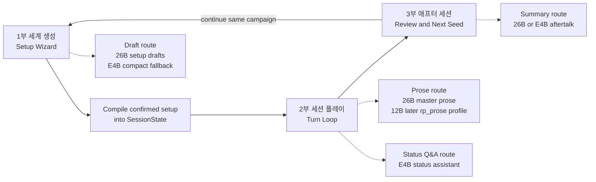
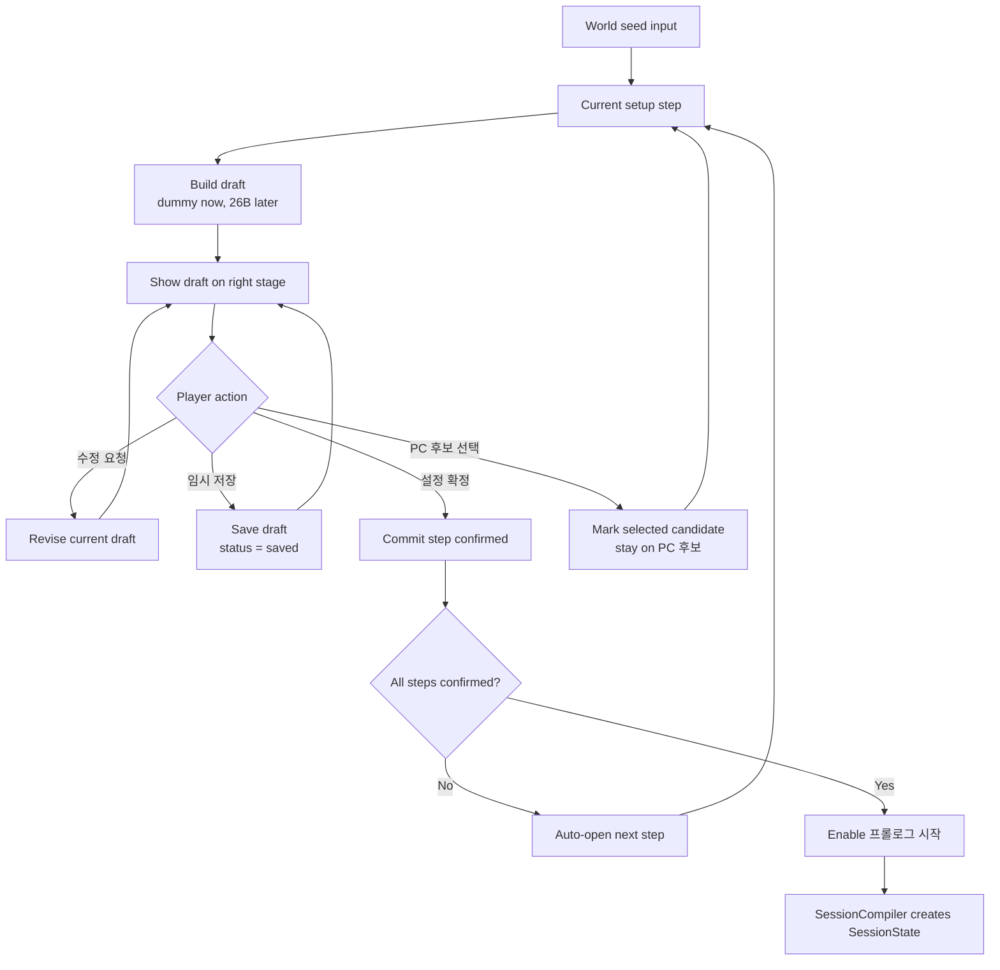
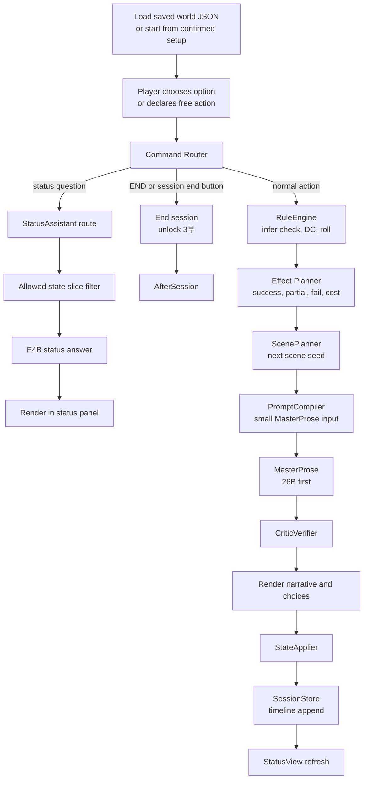
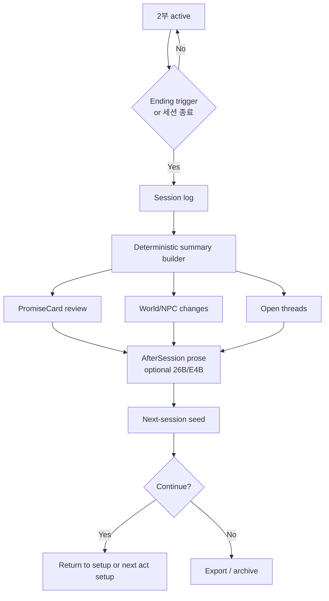

# Winterrain TRPG Architecture Design

Date: 2026-06-05

Source references:

- GPTs prompt references: `prompt/Core.md`, `prompt/Setup.md`, `prompt/StatusView.md`, `prompt/Ending.md`
- Benchmark designs:
  - `design/text-rpg-mystery-master-generation-benchmark-design.md`
  - `design/text-rpg-detective-reveal-scene-benchmark-design.md`

Current implementation decision:

```text
IMPLEMENT_E4B_PLUS_26B_FIRST
KEEP_12B_AS_RP_PROSE_TARGET
PROMPT_DIR_IS_REFERENCE_ONLY
```

`prompt/` is GPTs-oriented reference material and is intentionally ignored by git. The webapp should translate those contracts into app modules instead of depending on prompt files at runtime.

## Product Shape

Winterrain TRPG is not a freeform AI chat RP tool. It is a webapp for preparing, playing, and reviewing a single-player TRPG session.

The session has three parts:

```text
1부 세계 생성
2부 세션 플레이
3부 애프터 세션
```

Core product principle:

```text
장르는 플레이 규칙을 정하고, 세계관은 그 규칙에 감정과 몰입을 입힌다.
```

The user does not merely enter a setting. In 1부, the user and AI master co-create the small session rulebook: genre, world frame, play promises, PC, goals, NPCs, and prologue seed. In 2부, the app runs the game loop. In 3부, the app turns the session log into meaning and next-session material.

## Why This Is Not One Giant Prompt

The old ChatGPT Project prompt set works as a monolithic play contract, but a local webapp needs stricter ownership boundaries.

- Deterministic app code owns canonical state, rolls, effects, validation, logs, persistence, and export.
- Local models draft setup material and write player-facing prose.
- Model output never directly mutates canonical game state.
- Long prompt blocks should become small step-specific prompt contracts.
- Setup drafts remain drafts until the user confirms them.

## High-Level Flow



## Core Modules

| Module | Owner | Model? | Role |
| --- | --- | ---: | --- |
| `SetupWizard` | App + LLM | Yes | 1부 단계 진행, draft/confirmed 분리, 수정 요청 반영 |
| `SetupPromptCompiler` | App | No | `Setup.md` 계약을 단계별 작은 prompt로 변환 |
| `SetupStateStore` | App | No | seed, step draft, confirmed step, revision history 저장 |
| `SessionCompiler` | App | No | confirmed setup만 `SessionState`로 변환 |
| `SessionStore` | App | No | 세션 JSON, 턴 로그, world changes 저장 |
| `RuleEngine` | App | No | 판정, DC, 피로/사기, 목표 진행, 엔딩 조건 |
| `ScenePlanner` | App + optional LLM | Optional | 다음 장면 seed, required/forbidden beats 생성 |
| `MasterProse` | 26B first, 12B later | Yes | 플레이어용 장면 산문 생성 |
| `StatusView` | App | No | 상태창 deterministic 렌더링 |
| `StatusAssistant` | E4B | Yes | 허용된 상태 slice 안에서 질문 답변 |
| `StateApplier` | App | No | effects와 선택 결과를 canonical state에 반영 |
| `CriticVerifier` | App + optional model | Optional | POV, hidden truth, forced resolution, state mutation claim 검증 |
| `AfterSession` | App + optional LLM | Optional | 로그 기반 회고, 약속 카드 검토, 다음 seed 제안 |

## Data Model

Two states must stay separate.

### SetupState

`SetupState` is not the game state. It is a draft workspace for 1부.

```json
{
  "seed": "",
  "currentStep": "worldFrame",
  "steps": {
    "worldFrame": {
      "status": "drafted",
      "draft": {},
      "confirmed": null,
      "stale": false,
      "dependsOn": [],
      "revisionHistory": []
    },
    "worldContext": {
      "status": "locked",
      "draft": {},
      "confirmed": null,
      "stale": false,
      "dependsOn": ["worldFrame"],
      "revisionHistory": []
    },
    "pcCandidates": {
      "status": "locked",
      "draft": {},
      "confirmed": null,
      "selectedIndex": null,
      "stale": false,
      "dependsOn": ["worldFrame", "worldContext"],
      "revisionHistory": []
    },
    "characterDetail": {
      "status": "locked",
      "draft": {},
      "confirmed": null,
      "stale": false,
      "dependsOn": ["pcCandidates"],
      "revisionHistory": []
    },
    "sessionRules": {
      "status": "locked",
      "draft": {},
      "confirmed": null,
      "stale": false,
      "dependsOn": ["worldFrame", "worldContext", "characterDetail"],
      "revisionHistory": []
    },
    "prologue": {
      "status": "locked",
      "draft": {},
      "confirmed": null,
      "stale": false,
      "dependsOn": ["worldFrame", "worldContext", "characterDetail", "sessionRules"],
      "revisionHistory": []
    }
  }
}
```

`currentStep` enum:

```text
worldFrame
worldContext
pcCandidates
characterDetail
sessionRules
prologue
```

Step status:

```text
locked
drafted
saved
confirmed
```

Rules:

- `draft` may be regenerated or revised freely.
- `saved` preserves a work-in-progress draft but does not commit it to canonical setup.
- `confirmed` is the only value used by `SessionCompiler`.
- `stale` is separate from status. A confirmed step can remain confirmed but stale after an earlier dependency changes.
- `프롤로그 시작` must stay disabled while any required confirmed step is stale.
- Before prologue starts, the user must approve saving the compiled setup as `[캐릭터명]-[날짜]-[장르].json`.
- The saved JSON is the canonical base for play; LLM output can propose prose or effects but cannot mutate this file by claim.
- The user can go backward to revise a confirmed step. Dependent later steps should show stale warning badges until re-confirmed.

### SessionState

`SessionState` begins only after 1부 is confirmed and prologue starts.

```json
{
  "saveMeta": {
    "id": "",
    "createdAt": "",
    "updatedAt": "",
    "displayTitle": "",
    "phase": "setup_ready",
    "turn": 1,
    "playerName": "",
    "genre": "",
    "lastSceneTitle": "",
    "lastPlayedAt": null
  },
  "world": {
    "genre": "",
    "techLevel": "",
    "referenceWorld": "",
    "tone": "",
    "coreConflict": "",
    "promiseCard": {
      "type": "",
      "toggles": {},
      "promises": []
    },
    "context": ""
  },
  "rules": {
    "source": ["prompt/Core.md", "prompt/Setup.md", "prompt/StatusView.md"],
    "checks": {
      "formula": "1D20 + player.mods[ability] >= DC",
      "dcRange": {"min": 10, "max": 22},
      "difficultyMode": "easy",
      "easyMode": {
        "partialSuccessBias": true,
        "preserveCoreClues": true
      },
      "resolutionOrder": ["criticalFailure", "criticalSuccess", "success", "partialSuccess", "failure"],
      "activeResultBands": [],
      "resultBandsByDifficulty": {
        "쉬움": [
          {"key": "criticalSuccess", "condition": "natural20 or total >= dc + 5"},
          {"key": "success", "condition": "total >= dc"},
          {"key": "partialSuccess", "condition": "dc - 4 <= total < dc"},
          {"key": "failure", "condition": "dc - 8 <= total <= dc - 5"},
          {"key": "criticalFailure", "condition": "natural1 or total <= dc - 9"}
        ],
        "보통": [
          {"key": "criticalSuccess", "condition": "natural20 or total >= dc + 5"},
          {"key": "success", "condition": "total >= dc"},
          {"key": "partialSuccess", "condition": "dc - 2 <= total < dc"},
          {"key": "failure", "condition": "dc - 7 <= total <= dc - 3"},
          {"key": "criticalFailure", "condition": "natural1 or total <= dc - 8"}
        ],
        "어려움": [
          {"key": "criticalSuccess", "condition": "natural20 and total >= dc or total >= dc + 7"},
          {"key": "success", "condition": "total >= dc"},
          {"key": "partialSuccess", "condition": "total == dc - 1"},
          {"key": "failure", "condition": "dc - 6 <= total <= dc - 2"},
          {"key": "criticalFailure", "condition": "natural1 or total <= dc - 7"}
        ]
      },
      "dcGuidelines": []
    },
    "status": {
      "hp": {"range": [0, 100], "default": 70, "deathAt": 0},
      "fatigue": {"range": [0, 20], "startingRange": [8, 12], "bands": [], "recovery": {}},
      "morale": {"range": [0, 100], "default": 60, "startingRange": [50, 70], "bands": [], "gain": {}, "loss": {}}
    },
    "goals": {
      "shortGoalCompleteWhen": "player.goals.progress.shortPercent == 100",
      "mainGoalCompleteWhen": "player.goals.progress.mainComplete == true"
    },
    "narrationConstraints": {
      "hideNumbersInFiction": true,
      "allowedNumericSurfaces": ["rollBlock", "statusSummary", "statusView"],
      "turnOneSkipsRollBlock": true
    }
  },
  "player": {
    "name": "",
    "gender": "",
    "age": "",
    "background": "",
    "values": [],
    "traits": {"strengths": [], "flaws": []},
    "abilities": {"STR": 0, "DEX": 0, "CON": 0, "INT": 0, "WIS": 0, "CHA": 0},
    "mods": {"STR": 0, "DEX": 0, "CON": 0, "INT": 0, "WIS": 0, "CHA": 0},
    "initialStatus": {"hp": 70, "fatigue": 10, "morale": 60},
    "status": {"hp": 70, "fatigue": 10, "morale": 60},
    "goals": {
      "main": "",
      "short": "",
      "mainComplete": false,
      "progress": {"shortPercent": 0, "completedShort": [], "globalPercent": 0}
    },
    "speech": ""
  },
  "npcs": [
    {
      "name": "",
      "role": "",
      "relationTags": "",
      "speech": "",
      "initialRelationshipScore": 0,
      "relationshipScore": 0,
      "currentStatus": "",
      "lastSeen": "",
      "flags": []
    }
  ],
  "masterOnly": {
    "truthLocked": false,
    "truth": {
      "culprit": "",
      "motive": "",
      "method": "",
      "timeline": [],
      "lockedFacts": []
    },
    "clues": [],
    "redHerrings": []
  },
  "prologue": {
    "sceneTitle": "",
    "date": "",
    "time": "",
    "place": "",
    "summary": ""
  },
  "runtime": {
    "phase": "setup_ready",
    "turn": 1,
    "currentDate": "",
    "currentTime": "",
    "currentPlace": "",
    "currentSceneTitle": "",
    "lastPlayedAt": null
  },
  "session": {
    "knownFacts": [],
    "recentChange": "세션 준비 중",
    "log": []
  },
  "timeline": [],
  "summary": {
    "daysPassed": 0,
    "turnsTotal": 0,
    "npcCount": 0,
    "worldChanges": []
  }
}
```

### Ability Generation

능력치는 PC 후보를 선택한 뒤 `④ 캐릭터 상세` 단계에서 앱이 생성한다. 모델은 강점/결함 후보를 제안할 수 있지만, 최종 능력치와 보정치 계산은 앱이 deterministic하게 수행한다. 결과는 `player.abilities`와 `player.mods`에 분리 기록한다.

Abilities:

```text
STR / DEX / CON / INT / WIS / CHA
```

Generation order:

1. 기본값 생성
   - 결함이 없는 능력치: `rand(8, 12)`
   - 결함이 붙은 능력치: `rand(9, 12)`
   - 결함 능력치의 하한은 9다. `-3` 적용 뒤 최솟값이 6이 되어 보정치가 `-2`에 수렴하게 하기 위함이다.
2. 강점/결함 반영
   - 강점과 결함은 각각 최대 2개까지 지정할 수 있다.
   - 같은 능력치에 강점과 결함이 동시에 붙을 수 있다.
   - 강점만 있는 능력치: `+3`
   - 결함만 있는 능력치: `-3`
   - 강점과 결함이 모두 있는 능력치: `1D6`; 4 이상이면 `+1`, 3 이하이면 `-1`
3. 보정치 계산
   - `mod = floor((ability - 10) / 2)`
   - `player.mods.STR` 등 각 키에 기록한다.
4. 균형 검사 및 조정
   - 양수 보정 존재: `mod > 0`인 능력치가 1개 이상
   - 음수 보정 존재: `mod < 0`인 능력치가 1개 이상
   - 양수 보정 합 상한: `sum(max(mod, 0)) <= 4`
   - 음수 보정 합 하한: `sum(min(mod, 0)) >= -4`

Adjustment rules:

- 강점/결함이 붙은 능력치는 조정 대상에서 제외한다.
- 양수 합 초과 시, 보정치가 양수인 중립 능력치 중 가장 낮은 것부터 점수를 `-1`씩 조정한다.
- 음수 합 초과 시, 보정치가 음수인 중립 능력치 중 가장 높은 것부터 점수를 `+1`씩 조정한다.
- 중립 능력치가 모두 소진되어도 조건을 충족하지 못하면 앱은 경고를 표시하고 현재 상태로 확정할 수 있다.

Example:

| Ability | Base | Tag adjustment | Final | Mod |
| --- | ---: | ---: | ---: | ---: |
| STR | 10 | 0 | 10 | +0 |
| DEX | 11 | 0 | 11 | +0 |
| CON | 11 | -3 | 8 | -1 |
| INT | 9 | +3 | 12 | +1 |
| WIS | 8 | 0 | 8 | -1 |
| CHA | 10 | 0 | 10 | +0 |

For this example, `positiveSum = +1` and `negativeSum = -2`, so the balance check passes.

### SessionCompiler Mapping

`SessionCompiler` reads confirmed setup values only. It does not read `draft` values and must refuse or warn if any required confirmed step is stale.

| Setup step | SessionState target | Rule |
| --- | --- | --- |
| `worldFrame` | `world.genre`, `world.era`, `world.referenceWorld`, `world.tone`, `world.coreConflict` | ① 세계 골격 supplies the stable frame. |
| `worldContext` | `world.context` | ② 세계 맥락 is stored as context. It must not be silently merged into `world.coreConflict`. |
| `pcCandidates` | `source.selectedCandidate`, `player` seed reference | Only the selected candidate metadata is carried forward. Unselected candidates remain setup history, not runtime state. |
| `characterDetail` | `player`, `player.abilities`, `player.mods`, `player.initialStatus`, `player.status`, `npcs` | App-generated abilities/mods and confirmed NPC relationship network become canonical. |
| `sessionRules` | `world.promiseCard`, `rules.checks.difficultyMode`, `rules.checks.activeResultBands`, game-over rules | ⑤ locks long-term goal, genre promises, play difficulty, and ending conditions. |
| `prologue` | `player.goals.shortTerm`, `prologue`, `runtime.currentDate`, `runtime.currentTime`, `runtime.currentPlace`, `runtime.currentSceneTitle`, initial `session.knownFacts` | ⑥ creates the first playable scene and short-term goal. |

Short-term goal rule:

- `⑥ 프롤로그` proposes the initial short-term goal from the confirmed long-term goal, selected PC, and first scene pressure.
- The player may revise this value before confirming the prologue.
- The confirmed value is stored as `player.goals.shortTerm` and is used by the first 2부 status view.

Compatibility note:

- Internal names can be readable webapp names.
- When needed, adapters can compile to old `wf/ps/np/tl/su` prompt shapes.
- The old GPTs prompt schema is reference material, not the runtime storage format.
- `session.knownFacts` is not a log of every event. It stores only concise facts the PC has actually noticed, and the status view should render only the latest five.
- `session.recentChange` is separate from known facts. It summarizes the latest action/result or save/load/session event.
- `runtime.currentDate`, `runtime.currentTime`, `runtime.currentPlace`, and `runtime.currentSceneTitle` are required for 2부 loading and turn header rendering.

## 1부 세계 생성 UX

1부 is a session-zero style wizard. The player should feel that the session is being shaped with an AI master, not that a static setup form is being filled.

Current shell layout:

```text
left rail:
  world seed
  [세계 seed 적용]
  ① 세계 골격
  ② 세계 맥락
  ③ PC 후보
  ④ 캐릭터 상세
  ⑤ 세션 규칙
  ⑥ 프롤로그
  [설정 초기화]

center stage:
  current step draft

right control panel:
  request input + [수정 반영]
  right-aligned [임시 저장] [설정 확정]
```

### Setup Steps

| Step | Purpose | Output |
| --- | --- | --- |
| `① 세계 골격` | seed를 장르, 시대, 참조 세계, 톤, 핵심 갈등으로 정리 | `worldFrame` draft |
| `② 세계 맥락` | 정치/문화/권력/현재 긴장 상태를 1~2단락으로 구체화 | `worldContext` draft |
| `③ PC 후보` | 세계에 맞는 PC 후보 5명 제안 | temporary candidates |
| `④ 캐릭터 상세` | 선택한 PC의 배경, 가치관, 말투, 능력치, 보정치, 건강/피로/사기, 핵심 NPC를 확정 | `player.background`, `player.speech`, `player.abilities`, `player.status`, `npcs` |
| `⑤ 세션 규칙` | 장기 목표, 장르 약속, 난이도, 게임 오버 조건을 프롤로그 직전 확정 | `player.goals.longTerm`, `promiseCard`, `difficulty`, `gameOver` |
| `⑥ 프롤로그` | 이전 단계의 설정 요약을 최종 확인하고, 단기 목표와 첫 장면의 제목, 날짜, 시각, 장소, 상황 압력을 준비 | `setupReview`, `player.goals.shortTerm`, `prologue` |

### Setup Wizard Flow



### Setup Rules

- Setup is allowed to be conversational and revisable.
- `세계 seed 적용` converts the user's seed into the first world frame/context draft and marks setup from `① 세계 골격` as unconfirmed again.
- A revision request updates only the current step draft.
- `임시 저장` preserves the draft but does not make it canonical.
- `설정 확정` copies the draft into confirmed setup state and automatically opens the next step.
- In `③ PC 후보`, choosing a candidate only marks the selected card. `설정 확정` commits the candidate and opens `④ 캐릭터 상세`.
- `PC 다시 선택` is visible only in `④ 캐릭터 상세`, where the user can still naturally reject the selected PC before session rules and prologue are locked.
- `설정 초기화` is a global destructive action in the left rail. It returns setup to `① 세계 골격`, clears unconfirmed setup state, and requires confirmation.
- `④ 캐릭터 상세` owns the player's deeper background, speech style, values, strengths/flaws, six abilities, modifiers, health/fatigue/morale, and the initial relationship network.
- `⑤ 세션 규칙` locks the long-term goal, genre promises, play difficulty, and game-over conditions immediately before prologue.
- `⑥ 프롤로그` acts as the final pre-play review. It shows a compact setup summary, character summary, NPC summary, and the first scene seed before JSON save/start.
- A confirmed step becomes the source for later prompts.
- The app should expose progress clearly through circled-number navigation and per-step status.
- `프롤로그 시작` should remain disabled until all required setup steps are confirmed.
- When an earlier confirmed step changes, dependent later steps keep their confirmed values but become stale until re-confirmed.

## 2부 세션 플레이 UX

The default rule loop is intentionally simple.

```text
세계 설정 후, 상황이 제시된다
-> 선택지를 고르거나 직접 행동을 만든다
-> 행동의 결과를 주사위로 판정한다
-> 판정을 반영하여 다음 상황을 만든다
```

The webapp should show the main play panel and status panel together.

```text
main play panel:
  loaded world / PC / turn header
  scene title
  save / world load / session end actions
  date-time-place block
  narrative
  roll result
  choices
  free action input

status panel:
  HP / fatigue / morale
  current goal
  latest five PC-known facts
  recent change as separate event summary
  allowed status Q&A
```

2부 can start in either of two ways:

1. Continue directly from 1부 after saving the compiled setup JSON.
2. Load a previously saved world JSON from `data/worlds/`.

The current local server exposes:

| Route | Role |
| --- | --- |
| `POST /api/worlds` | Save compiled world/session JSON under `data/worlds/`, preserving unique filenames. |
| `GET /api/worlds` | Return loadable world summaries: title, PC, genre, phase, turn, and last scene. |
| `GET /api/worlds/{fileName}` | Load a selected world JSON into 2부. |

### Turn Pipeline



Rules:

- Roll and effects are decided before prose generation.
- Prose sees `roll_result`, but cannot override it.
- `MasterProse` returns visible text, choices, and short summary.
- World/NPC change candidates are suggestions only and must be validated.
- The app writes canonical state and timeline.
- The play header displays current loaded world, PC name, turn number, scene title, date, time, and place from canonical state.
- `세계 로드` must replace the current play state from JSON rather than asking the model to reconstruct it.
- `세션 종료` unlocks 3부 and moves the player to after-session review. Starting or loading a session locks 3부 again.

## Status Panel

Status is a play aid, not a second master.

Role:

```text
현재 상태 제시 + 게임 허용 범위 안에서 유저 질문에 답변
```

Allowed:

- summarize canonical state
- explain only PC-known information
- answer questions about HP, fatigue, morale, goals, known clues, NPC relationships, and recent logs
- restate available options without choosing for the player

Forbidden:

- reveal hidden truth
- infer undiscovered clues
- recommend the single correct action
- progress the scene
- mutate state

Routing:

| Surface | Owner | Model route |
| --- | --- | --- |
| Main play prose | `MasterProse` | 26B first, 12B later for `rp_prose` profile |
| Status rendering | App | deterministic |
| Status Q&A | `StatusAssistant` | E4B is sufficient |
| State changes | `StateApplier` | app only |

Current status rendering contract:

- `knownFacts`: latest five concise facts the PC has actually noticed.
- `recentChange`: latest visible action/result, save/load marker, or session-end marker.
- Do not store short-term goals, prologue readiness, roll math, or general system events as known facts.
- If no PC-known facts exist, render an empty-state message instead of inventing information.

## 3부 애프터 세션

After session is part of play. It is where the player sees what the session meant and what can continue.

3부 must remain disabled until 2부 is explicitly ended. The tab is locked during setup, during a loaded/active session, and after restarting or loading another session. It unlocks only when the session reaches an ending trigger or the player presses `세션 종료`.

After session should summarize:

- important choices
- roll outcomes and durable consequences
- goal progress
- NPC and faction changes
- world changes
- promise-card fit
- next-session seeds



## Hard Invariants

These are app-level constraints, not only prompt instructions.

1. Single PC limited third-person perspective.
2. NPCs may only speak from their own knowledge.
3. PC/NPC speech style must follow confirmed speech settings.
4. Model output does not mutate numeric or canonical state.
5. Model output must not claim it saved files or updated state.
6. Stored truth, world frame, promise card, and confirmed setup cannot drift silently.
7. Genre promise card is fixed during a session unless the user explicitly starts a new setup/act transition.
8. Basic ending triggers are `hp <= 0`, `mainComplete == true`, and player `END`.
9. World tone and play difficulty are separate.
10. Mystery truth must be locked before play or before the mystery case begins.

## Prompt Compilation

Do not send all reference prompts every turn. Compile small prompts.

### Setup Draft Prompt

Each setup step should receive:

```json
{
  "seed": "",
  "confirmedPriorSteps": {},
  "currentStep": "",
  "revisionRequest": "",
  "outputContract": {}
}
```

The model returns a step draft only. The app stores it as draft until the user confirms.

### MasterProse Input

```json
{
  "rules": {
    "pov": "single_pc_limited_third_person",
    "npcKnowledge": "direct_knowledge_only",
    "speech": "use_confirmed_speech_styles",
    "noStateMutationClaims": true,
    "stopBeforeResolutionUnlessEnding": true
  },
  "world": {
    "genre": "",
    "tone": "",
    "referenceWorld": "",
    "promiseCard": "",
    "contextSummary": ""
  },
  "player": {
    "name": "",
    "background": "",
    "values": [],
    "traits": [],
    "speech": "",
    "currentGoal": ""
  },
  "turn": {
    "number": 0,
    "location": "",
    "previousChoice": "",
    "roll": {"ability": "", "formula": "", "success": true, "summary": ""},
    "sceneSeed": "",
    "effectsPreview": {},
    "requiredBeats": [],
    "forbiddenBeats": []
  }
}
```

### MasterProse Output

```json
{
  "title": "",
  "visibleText": "",
  "choices": ["", "", ""],
  "shortSummary": "",
  "worldChangeCandidates": [],
  "npcChangeCandidates": []
}
```

The app may accept `visibleText`, `choices`, and `shortSummary` directly. All candidates require validation.

## Runtime Model Profiles

Local deployment should treat large-model choice as a service profile, not a cheap per-turn switch.

| Profile | Loaded models | Use case |
| --- | --- | --- |
| `fast_stable` | E4B + 26B | Initial implementation. E4B for status/short text, 26B for setup and master prose. |
| `rp_prose` | E4B + 12B | Later profile for stronger RP prose, reveal scenes, and endings. |

Initial default:

```text
fast_stable = E4B + 26B
```

Model routing:

| Task | Preferred | Fallback | Notes |
| --- | --- | --- | --- |
| Setup step draft | 26B | E4B compact draft | 1부 wizard |
| Setup revision | 26B | E4B for small edits | Must update draft only |
| Status Q&A | E4B | App deterministic response | Use allowed state slice |
| Short transition | E4B | active large model | Low-stakes turns |
| Normal master prose | 26B | E4B brief prose | Initial default |
| Mystery clue scene | 26B | E4B short draft | Truth must stay locked |
| Detective reveal | 26B first | 12B in later profile | Reuse Bench 3 criteria |
| Ending prose | 26B | E4B brief epilogue | App appends deterministic result |
| After session summary | App + E4B/26B | App only | Must ground in logs |

## Tone And Difficulty

World tone and play difficulty are separate. A setting can be oppressive, tragic, noir, or politically dangerous while the play loop still gives frequent success, partial success, and small durable changes.

| Axis | Meaning | Example values |
| --- | --- | --- |
| `worldTone` | Emotional and genre atmosphere | hopeful, realistic, noir, bleak, tragic |
| `playDifficulty` | How often player actions succeed | easy, normal, hard |
| `failureCost` | How much failure hurts PC, NPCs, or world | low, medium, high |
| `hopeGuarantee` | Whether small wins survive pressure | none, small_wins, hopeful_resistance |

Recommended modes:

| Mode | Contract |
| --- | --- |
| `hopeful_resistance` | Dark setting, softened failures, small durable gains survive. |
| `realist_pressure` | Costs matter, partial success is common, story keeps moving. |
| `tragic_pressure` | High failure cost; use only when explicitly chosen. |

Runtime rule when `worldTone` is dark but `playDifficulty` is easy:

- keep institutional pressure visible
- prefer success or partial success over dead-end failure
- make costs indirect and manageable
- preserve at least one small concrete gain per major arc
- avoid total negation unless the player opted into `tragic_pressure`

## Genre Profiles

Genre determines what play means. Setting determines how that play feels alive.

| Genre | Core fantasy | Primary state | Typical pressure | Prototype fit |
| --- | --- | --- | --- | --- |
| 생활/모험 | 일상 속 사건, 작은 성취, 관계 변화 | goals, NPC relations, light resources | fatigue, time, social friction | Good first |
| 탐사 | 숨겨진 장소와 비밀 해금 | locationMap, siteTruth, discoveries, hazards, access | locked areas, resource/time pressure | Good second |
| 추리 | 단서, 모순, 범인/수법 추론 | truthLock, clues, knownBy, suspicion, records | false leads, source risk, evidence decay | Later |
| 정치 | 세력 사이 신용/명분/거래 축적 | factions, leverage, publicNarrative, reputation, riskExposure | faction distrust, debt/favor chains | Later |
| 전쟁 | 전선/보급/사기/명령 판단 | fronts, forces, supply, morale, commanders | attrition, fog of war, logistics | Later |

Genre promise cards:

| Card | Default promise |
| --- | --- |
| 생활/모험 | small wins, recoverable setbacks, relationship beats |
| 탐사 | core secret exists, discovery is rewarded, curiosity matters |
| 추리 | truth exists, fair clues, no pure accident/luck solution unless opted in |
| 정치 | factions act proactively, deals have costs, public narrative matters |
| 전쟁 | logistics and morale matter, fog of war exists, orders have delay |

### Mystery Rule

Mystery is fair only when the answer exists before play.

Minimum `truthLock`:

```json
{
  "culprit": "",
  "victim": "",
  "method": "",
  "motive": "",
  "timeline": [],
  "coreEvidence": [],
  "redHerrings": [],
  "revelationConditions": []
}
```

The model may improvise scenes, NPC reactions, atmosphere, minor clues, and discovery routes, but not culprit, method, motive, or core evidence.

### Political / Strategic Rule

Political play needs persistent pressure objects:

- `factions`
- `leverage`
- `publicNarrative`
- `reputation`
- `riskExposure`
- `records`
- `unresolvedThreads`

One action can mean different things to different audiences.

## Turn Types

Define turn type before model call.

```text
setup
prologue
normal_scene
investigation
dialogue
combat_or_danger
political_pressure
exploration
detective_reveal
short_transition
ending
aftertalk
```

For `detective_reveal`, reuse Bench 3 criteria:

- do not steal player conclusion
- keep culprit/truth fixed
- integrate known evidence
- include NPC/crowd reaction
- stop before confession/arrest/verdict unless ending turn

## Storage And Logs

Store three layers.

1. Setup workspace:
   - seed
   - step drafts
   - confirmed setup values
   - revision history

2. Canonical session state:
   - world/player/npc/timeline/summary
   - deterministic, compact, queryable

3. Narrative transcript:
   - rendered turn text
   - player input
   - selected choices
   - model id, latency, prompt version
   - validation warnings

This allows replay, export, after-session review, and model comparison without trusting model claims.

## Validation

Minimum validators:

- `setupRequiredFields`: current setup step has required draft fields
- `setupDependencyStale`: later confirmed steps may be stale after earlier changes
- `povLeak`: impossible knowledge or hidden truth exposure
- `forcedResolution`: premature confession/arrest/verdict
- `stateMutationClaim`: "상태를 갱신했다", "저장했다" style claims
- `speechStyle`: PC/NPC speech style drift
- `promiseCard`: genre promises and forbidden beats
- `toneDifficultyContract`: bleak tone does not imply harsh play unless chosen
- `lengthProfile`: per turn type
- `choiceCount`: 2~4 choices unless freeform-only

Validation results should be visible in dev/debug UI, not normal play UI.

## Webapp Interface

Primary navigation:

- `1부 세계`: setup wizard shell
- `2부 플레이`: main play panel + status panel
- `3부 애프터`: disabled until 2부 ends; then session summary, promise-card review, next seed, export/replay

1부 current shell:

- left rail with seed and circled-number steps
- center stage step draft card
- right control panel with request input, revise action, and right-aligned save/confirm actions
- prologue start disabled until setup is confirmed

2부 current shell:

- scene title header with loaded world, PC name, and turn number
- save, world load, and session end buttons
- separate date/time/place block
- narrative area
- roll result strip
- choice buttons
- free action input
- status panel with deterministic state and allowed Q&A
- known facts and recent change are rendered as separate state surfaces

3부 current shell:

- disabled until explicit session end
- summary cards for important choices, promise-card review, and next seed

Avoid exposing raw JSON in normal play. Add export under advanced menu later.

## Benchmarks To Add

1. `setup-step-draft`
   - seed + prior confirmed steps -> one setup step draft.

2. `setup-revision-discipline`
   - revision request updates only current draft and preserves confirmed prior steps.

3. `normal-turn-continuity`
   - player action -> roll -> prose without hidden knowledge.

4. `status-render-deterministic`
   - app-rendered status matches canonical state.

5. `detective-reveal-round2`
   - compact stored setup + current player declaration only.

6. `ending-with-promise-card`
   - ending reveals culprit/motive/method/evidence when mystery promises require it.

## Adoption Plan

Phase 1:

- Keep GPTs prompts as reference docs only.
- Build static setup wizard shell with dummy data.
- Add SetupState shape and step navigation behavior.
- Build deterministic status view and simple turn log.
- Add local JSON save/load shell for `data/worlds/`.
- Lock after-session until 2부 ends.

Phase 2:

- Implement setup step draft API route with 26B.
- Add setup revision route.
- Compile confirmed setup into `SessionState`.
- Add validators for setup required fields and stale dependencies.

Phase 3:

- Implement normal turn pipeline with deterministic roll/effects.
- Add E4B/26B routing.
- Add status Q&A with allowed state slice.

Phase 4:

- Add optional 12B `rp_prose` profile.
- Add reveal/ending validators and human preference reports.
- Add session export/import, replayable logs, and after-session review.

## Current RP Model Judgment

Current local benchmark read:

```text
E4B: short transitions, status Q&A, fast compact drafts
26B: stable fast baseline for setup and master prose
12B: preferred RP prose target for plot, atmosphere, and climactic scenes
```

12B should not be treated as an agentic worker. Its best role is master prose generation under deterministic app control.

Operational target:

```text
initial = E4B + 26B
later rp_prose = E4B + 12B
```

The first milestone should prove that setup wizard flow, state separation, turn pipeline, validation, and UI interaction work correctly. After that, the same pipeline can be rerun under the `rp_prose` profile to recover stronger 12B writing style.
