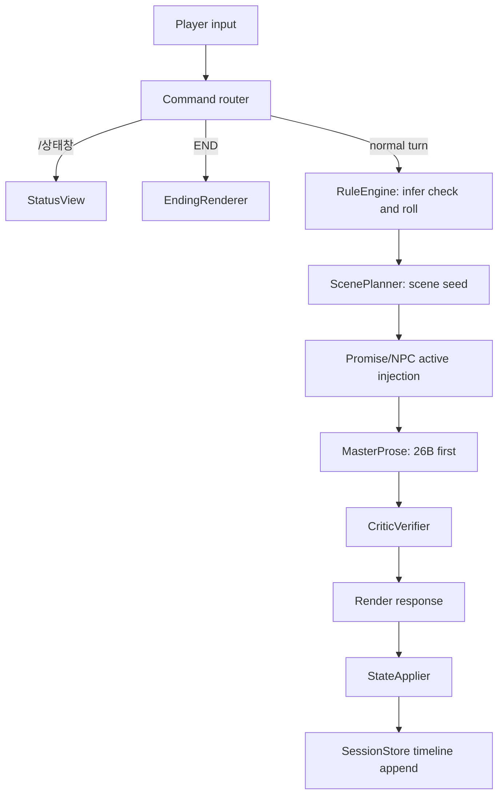

# Winterrain RP Module Architecture Design

Date: 2026-06-05
Source prompts:

- `/Users/kioku/Documents/Winterrain/10_프로젝트/창작_겨울비RPG/GPTs/Core.md`
- `/Users/kioku/Documents/Winterrain/10_프로젝트/창작_겨울비RPG/GPTs/Setup.md`
- `/Users/kioku/Documents/Winterrain/10_프로젝트/창작_겨울비RPG/GPTs/Ending.md`
- `/Users/kioku/Documents/Winterrain/10_프로젝트/창작_겨울비RPG/GPTs/StatusView.md`

Decision: `IMPLEMENT_E4B_PLUS_26B_FIRST`, `KEEP_12B_AS_RP_PROSE_TARGET`

## Goal

ChatGPT Project용 단일 프롬프트 세트를 웹앱/로컬 모델용 RP 모듈 구조로 재설계한다.

핵심 방향:

- 상태 변경, 판정, 목표 진행, 로그 저장은 deterministic engine이 담당한다.
- 모델은 "상태를 직접 수정하는 주체"가 아니라 "장면 시드와 상태 요약을 받아 플레이어용 산문을 쓰는 마스터"로 제한한다.
- 우선 구현은 `E4B + 26B`로 한다.
- 26B는 이미 OpenClaw에서 쓰고 있고, 속도가 빠르므로 개발 단계에서는 실제 의도대로 작동하는지 검증하기 좋다.
- 12B는 RP 산문 품질 목표로 보존하되, 초기 구현 기본 모델로 삼지 않는다.
- E4B는 짧은 전환, 요약, UI 보조 문구, compact draft에 사용한다.

## Why Not One Giant Prompt

기존 프롬프트는 ChatGPT Project 환경에서는 잘 맞지만, 웹앱/로컬 모델 운영에서는 다음 문제가 생긴다.

- 모델이 상태 JSON을 직접 갱신하면 drift와 누락이 생긴다.
- 판정, 피로/사기, 목표 진척 같은 수치 규칙이 산문 생성과 섞여 검증이 어렵다.
- 긴 프롬프트를 매 턴 넣으면 latency와 context 비용이 커진다.
- 12B는 RP 문체는 강하지만 에이전틱 상태 조작에는 큰 이점이 없었고, 26B와 동시에 올리기 어렵다.

따라서 프롬프트는 runtime prompt가 아니라 module contract/reference로 삼고, 실제 실행은 작은 역할 단위로 쪼갠다.

## Core Modules

| Module | Owner | Model? | Role |
| --- | --- | ---: | --- |
| `SessionStore` | App | No | 세션 JSON, 턴 로그, world changes 저장 |
| `SetupWizard` | App + LLM | Yes | 세계/PC/NPC 초안 생성, 사용자 확정 |
| `RuleEngine` | App | No | 판정, DC, 피로/사기, 목표 진행, 엔딩 조건 |
| `ScenePlanner` | App + optional LLM | Optional | 다음 장면 seed 생성, NPC 선제 행동 후보 생성 |
| `MasterProse` | 26B first, 12B later | Yes | 플레이어용 장면 산문 생성 |
| `StateApplier` | App | No | effects와 선택 결과를 state에 반영 |
| `StatusView` | App | No/Optional | 상태창 표 렌더링. 원칙적으로 deterministic |
| `EndingRenderer` | 12B/26B | Yes | 엔딩 본문 산문 + deterministic result block |
| `CriticVerifier` | App + optional smaller model | Optional | POV, forced-resolution, state mutation claim 검증 |

## Data Model

기존 Core 스키마를 그대로 출발점으로 삼되, 웹앱 내부에서는 더 명시적인 이름으로 감싸는 것을 권장한다.

```json
{
  "world": {
    "genre": "",
    "techLevel": "",
    "referenceWorld": "",
    "tone": "",
    "coreConflict": "",
    "promiseCard": {
      "type": "",
      "toggles": {},
      "promises": []
    },
    "context": ""
  },
  "player": {
    "name": "",
    "background": "",
    "values": [],
    "traits": {"strengths": [], "flaws": []},
    "abilities": {"STR": 0, "DEX": 0, "CON": 0, "INT": 0, "WIS": 0, "CHA": 0},
    "mods": {"STR": 0, "DEX": 0, "CON": 0, "INT": 0, "WIS": 0, "CHA": 0},
    "status": {"hp": 70, "fatigue": 10, "morale": 60},
    "goals": {
      "main": "",
      "short": "",
      "mainComplete": false,
      "progress": {"shortPercent": 0, "completedShort": [], "globalPercent": 0}
    },
    "speech": ""
  },
  "npcs": {},
  "timeline": [],
  "summary": {
    "daysPassed": 0,
    "turnsTotal": 0,
    "npcCount": 0,
    "worldChanges": []
  }
}
```

Compatibility note:

- 저장 포맷은 새 이름을 써도 된다.
- prompt input으로 넘길 때는 기존 `wf/ps/np/tl/su` 요약 형태로 compile할 수 있다.
- 기존 GPT prompt와 호환이 필요하면 import/export adapter를 둔다.

## Hard Invariants

이 규칙은 모델 prompt가 아니라 app-level 검증 기준이다.

1. 단일 PC 3인칭 제한 시점.
2. NPC는 자기 인지 범위만 말한다.
3. PC/NPC 말투는 `speech`/`tp`를 따른다.
4. 모델은 수치 상태를 직접 변경하지 않는다.
5. 모델은 "파일/상태를 저장했다"고 주장할 수 없다.
6. 범인/진상/세계 설정은 stored truth와 충돌할 수 없다.
7. 장르 약속 카드는 세션 중 고정된다.
8. 엔딩 조건은 `hp <= 0`, `mainComplete == true`, player `END`만 기본으로 한다.
9. 세계 톤과 플레이 난이도는 분리한다. 암울한 세계라도 쉬운 난이도와 낮은 실패 대가를 선택할 수 있어야 한다.
10. 추리 장르에서는 시작 시점에 진상과 결말 구조가 고정되어야 한다. 플레이 중 마스터가 범인, 수법, 핵심 동기를 바꾸면 안 된다.

## Turn Pipeline



Recommended behavior:

- Roll and effects are decided before prose generation.
- Prose sees `roll_result`, but cannot override it.
- `MasterProse` returns only visible text plus optional structured hints, never full state.
- `StateApplier` writes timeline, effects, NPC changes, goals.

## Prompt Compilation

Do not send the whole Core prompt every turn. Compile small prompts.

### MasterProse Input

```json
{
  "rules": {
    "pov": "single_pc_limited_third_person",
    "npcKnowledge": "direct_knowledge_only",
    "speech": "use_player_and_npc_speech_styles",
    "noStateMutationClaims": true,
    "stopBeforeResolutionUnlessEnding": true
  },
  "world": {
    "genre": "",
    "tone": "",
    "referenceWorld": "",
    "promiseCard": "",
    "contextSummary": ""
  },
  "player": {
    "name": "",
    "background": "",
    "values": [],
    "traits": [],
    "speech": "",
    "currentGoal": ""
  },
  "npcs": [
    {"id": "", "name": "", "role": "", "relationship": "", "attitude": 0, "state": "", "speech": "", "knownFacts": []}
  ],
  "turn": {
    "number": 0,
    "date": "",
    "time": "",
    "location": "",
    "previousChoice": "",
    "roll": {"ability": "", "formula": "", "success": true, "summary": ""},
    "sceneSeed": "",
    "effectsPreview": {"hp": 0, "fatigue": 0, "morale": 0, "goalProgress": 0},
    "requiredBeats": [],
    "forbiddenBeats": []
  }
}
```

### MasterProse Output

```json
{
  "title": "",
  "visibleText": "",
  "choices": ["", "", ""],
  "shortSummary": "",
  "worldChangeCandidates": [],
  "npcChangeCandidates": [
    {"npcId": "", "attitudeDelta": 0, "stateHint": "", "comment": ""}
  ]
}
```

The app may accept only `visibleText`, `choices`, and `shortSummary` from the model. All candidates must be validated before application.

## Runtime Model Profiles

현재 로컬 제약상 E4B, 26B, 12B를 모두 동시에 올리는 운영은 현실적이지 않다. Bench 1~3 실행에서도 12B는 26B가 로드된 상태에서 Metal memory/compute conflict가 발생했고, 26B를 내린 뒤 단독으로 실행해야 안정적이었다.

따라서 실제 웹앱 운영 프로파일은 아래 둘 중 하나로 본다.

| Profile | Loaded models | Use case |
| --- | --- | --- |
| `fast_stable` | E4B + 26B | 기본 운영. 짧은 전환은 E4B, 대부분의 고품질 생성은 26B. |
| `rp_prose` | E4B + 12B | RP 산문 우선 운영. 짧은 전환은 E4B, 플롯/분위기/클라이맥스는 12B. |

26B와 12B 사이 전환은 lightweight route switch가 아니라 service profile switch로 취급한다. 즉, 앱에서 "클라이맥스 장면만 12B로 잠깐 호출"하려면 26B를 내리고 12B를 올리는 지연 비용이 생긴다. 실사용에서는 세션 시작 또는 세션 모드 선택 시 `fast_stable` / `rp_prose` 중 하나를 고르는 편이 낫다.

Implementation default:

```text
fast_stable = E4B + 26B
```

Reason:

- 26B는 이미 OpenClaw에서 쓰고 있어 운영 경로가 익숙하다.
- 26B는 12B보다 빠르며, 초기 개발에서는 문체 최적화보다 turn loop와 state engine이 의도대로 작동하는지 검증하는 것이 더 중요하다.
- E4B는 짧은 연결, 선택지 정리, 상태 요약 보조에 충분하다.
- 12B의 RP 산문 선호는 유지하되, `rp_prose` 프로파일은 개발 안정화 후 추가한다.

## Model Routing

| Task | Preferred | Fallback | Notes |
| --- | --- | --- | --- |
| Setup world/context prose | 26B | E4B for compact draft | Initial implementation uses `fast_stable` |
| PC candidate generation | 26B | E4B | Store compact structured candidates |
| Short transition turn | E4B | active large model | Use faster model when stakes are low |
| Mystery clue scene | 26B | E4B for short draft | Retest 12B later after implementation is stable |
| Climactic reveal scene | 26B first | none without profile switch | Bench 3 style winner is 12B, but dev default stays 26B |
| Deterministic status view | App | none | No model needed |
| Ending prose | 26B | E4B for brief epilogue | Then app appends deterministic result summary |
| State validation | App | optional E4B/26B | Keep primary validation deterministic |

Loading UX:

- 12B route, when added later, should show a deliberate waiting state.
- Suggested text: `마스터가 고민 중입니다...`
- For climax scenes, slow generation can be framed as dramatic pause rather than failure.

## Setup Flow

`Setup.md` maps to a wizard with checkpoints.

1. World input
2. World draft
3. Promise card
4. PC candidates
5. PC speech style
6. Goals
7. Initial NPCs
8. Abilities/status
9. Prologue seed

Important change:

- The app owns confirmation state.
- LLM drafts are not committed until user confirms.
- Candidate regeneration count is tracked by the app.
- Setup should ask or infer not only world tone, but also play difficulty, failure cost, and hope/small-win guarantees.

## Webapp Session Shape

The webapp should treat the session as three parts.

```text
1부 세계 생성
2부 세션 플레이
3부 애프터 세션
```

This mirrors tabletop RPG practice: world creation and after-session reflection are not secondary utilities; they are part of play.

### 1부 세계 생성

World creation is the expectation-building phase.

The webapp should preserve the shape of `prompt/Setup.md`: the user gives a seed, then the AI master turns it into a concrete world draft, promise card, PC candidates, speech style, goals, NPCs, abilities/status, and prologue seed through confirmation checkpoints.

The user does not only fill a one-line form or choose a setting. The user and AI master co-create the small session rulebook:

- genre: what kind of play this session promises
- background: where that play becomes vivid
- tone: what emotional texture the world has
- difficulty: how often actions succeed
- failure cost: what failure can damage
- promise card: what the session should preserve or reward
- protagonist, goal, and initial situation

Recommended setup checkpoints:

1. world seed input
2. world frame and world context draft
3. world revision or confirmation
4. genre promise card and toggles
5. five PC candidates
6. PC speech style
7. long-term and short-term goals
8. two or three initial NPCs
9. abilities, modifiers, and initial status
10. prologue seed

Core principle:

```text
장르는 플레이 규칙을 정하고, 세계관은 그 규칙에 감정과 몰입을 입힌다.
```

The app owns confirmation state. LLM drafts are candidates until the user accepts them.

`prompt/Setup.md` remains a reference for this flow, but `prompt/` is GPTs-only material and is ignored by git. New webapp implementation should translate the setup contract into app modules rather than depending on that prompt file at runtime.

### 2부 세션 플레이

The default play loop is intentionally simple.

```text
세계 설정 후, 상황이 제시된다
-> 선택지를 고르거나 직접 행동을 만든다
-> 행동의 결과를 주사위로 판정한다
-> 판정을 반영하여 다음 상황을 만든다
```

System responsibilities:

- app: state, rolls, DC, effects, logs, validators
- model: player-facing situation prose and choice wording
- user: choice selection or free action declaration

Genre modules do not replace this loop. They define what the roll result changes and what should persist afterward.

Examples:

- 추리: clues, knownBy, suspicion, records, theoryState
- 탐사: locationMap, discoveries, hazards, access
- 정치: factions, leverage, publicNarrative, reputation, riskExposure
- 생활/모험: goals, NPC relations, inventory/light resources, current location

### 3부 애프터 세션

After session turns logs into meaning and prepares the next play contract.

It should summarize:

- important choices
- roll outcomes and durable consequences
- goal progress
- NPC and faction changes
- world changes
- promise-card fit
- next-session seeds

Aftertalk may use a model for prose, but the summary must be grounded in canonical logs.

## Status Panel

In the webapp, the status panel can stay visible beside the main play panel. This removes the `/상태창` routing pressure that exists in a single chat stream.

Status panel role:

```text
현재 상태 제시 + 게임 허용 범위 안에서 유저 질문에 답변
```

Status is a play aid, not a second master.

Allowed:

- summarize canonical state
- explain known information
- answer questions about current HP, fatigue, morale, goals, known clues, NPC relationships, and recent logs
- restate available options without choosing for the player

Forbidden:

- reveal hidden truth
- infer undiscovered clues
- recommend the single correct action
- progress the scene
- mutate state

Routing:

| Surface | Owner | Model route |
| --- | --- | --- |
| Main play prose | `MasterProse` | 26B first, 12B later for `rp_prose` profile |
| Status rendering | App | deterministic |
| Status Q&A | `StatusAssistant` | E4B is sufficient |
| State changes | `StateApplier` | app only |

## Tone And Difficulty

AI master mode should explicitly support a separation between bleak setting and harsh play. A world can be oppressive, tragic, noir, or politically dangerous while the actual play loop still gives the player frequent success, partial success, and small durable changes.

This is important because one advantage of an AI master is that it can honor requests like "the background is dark, but make the difficulty easier" without flattening the atmosphere.

### Axes

| Axis | Meaning | Example values |
| --- | --- | --- |
| `worldTone` | The emotional and genre atmosphere of the setting | hopeful, realistic, noir, bleak, tragic |
| `playDifficulty` | How often player actions succeed mechanically | easy, normal, hard |
| `failureCost` | How much a failed action hurts the PC, NPCs, or world | low, medium, high |
| `hopeGuarantee` | Whether the session should preserve small wins despite pressure | none, small_wins, hopeful_resistance |

### Recommended Modes

| Mode | Contract |
| --- | --- |
| `hopeful_resistance` | Dark or oppressive setting, but failures are rare or softened; small records, alliances, or protected truths can survive. |
| `realist_pressure` | Failures and costs occur, but partial success is common and the story keeps moving. |
| `tragic_pressure` | Failure costs are high; use only when the player explicitly wants a harsher story. |

### Example

The 루샤오위 session is best described as:

```text
worldTone = bleak_noir
playDifficulty = easy
failureCost = low_to_medium
hopeGuarantee = hopeful_resistance
```

The world stayed grim: martial-law Taipei, hospital records, police pressure, erased deaths. But the play experience did not become helpless. The player could make small, durable changes: one death record moved out of the "stair accident" drawer, a detective ally kept a second file, and an internal guide survived for the next person.

### Runtime Rule

When `worldTone` is dark but `playDifficulty` is easy:

- keep institutional pressure visible
- prefer success or partial success over dead-end failure
- make costs indirect and manageable
- preserve at least one small concrete gain per major arc
- avoid "the system crushes everything" unless the player opted into `tragic_pressure`
- use setbacks as complications, not negation of prior progress

## Target Genre Profiles

Current target genres:

```text
생활/모험
탐사
추리
정치
전쟁(토탈워 느낌)
```

The prototype can start with one easy genre, but the architecture should keep these four genre families in mind.

Design priority:

```text
Genre determines play.
Setting colors and constrains fiction.
```

Genre is more important than setting for the game engine. The setting mainly provides people, institutions, technology, culture, names, taboos, geography, and how the world plausibly works. Genre determines the game elements: what counts as progress, what state must persist, what kinds of pressure matter, what the player is promised, what failure means, and what the turn loop should foreground.

Examples:

- A haunted mansion exploration and an abandoned space station exploration have different settings, but both need locations, secrets, locks, hazards, and discovery progress.
- A medieval monastery mystery and a 2000s Japan island mystery have different settings, but both need clues, suspects, fair revelation, and hidden truth discipline.
- A Roman Republic finance drama and a modern city hall political drama have different settings, but both need factions, leverage, public narrative, reputation, and risk exposure.
- A fantasy border war and a 20th-century total-war campaign have different settings, but both need fronts, supply, commanders, morale, orders, and fog of war.

Therefore:

- Choose genre first.
- Load the genre module's state schema, promise card, turn types, and validators.
- Then apply setting to fill concrete names, social rules, technology limits, institutions, NPC roles, and prose style.

| Genre | Core fantasy | Primary state | Typical pressure | Good first implementation? |
| --- | --- | --- | --- | --- |
| 생활/모험 | 일상 속 사건, 탐험, 작은 성취, 관계 변화 | goals, NPC relations, inventory/light resources, location notes | fatigue, time, social friction, small danger | Yes |
| 탐사 | 숨겨진 장소, 금지구역, 비밀의 층위 해금 | locationMap, siteTruth, discoveries, hazards, access | locked areas, resource/time pressure, environmental danger, secrets | Yes / Good second |
| 추리 | 단서 수집, 모순 발견, 범인/수법 추론 | clues, knownBy, suspicion, records, timelines | false leads, source risk, suspect pressure, evidence decay | Later |
| 정치 | 세력 사이 포지션 만들기, 신용/명분/거래 축적 | factions, leverage, publicNarrative, reputation, riskExposure | faction distrust, public framing, debt/favor chains, retaliation | Later |
| 전쟁(토탈워 느낌) | 부대/전선/보급/사기 관리와 큰 작전 판단 | fronts, forces, supply, morale, commanders, territory | attrition, fog of war, logistics, command delay | Later |

### 생활/모험

Best prototype candidate because it can use the smallest reliable state.

Minimum state:

- PC status and current goal
- 2~4 active NPCs
- current location and recent world changes
- simple inventory/resources if needed
- session tone/difficulty contract

Useful turn types:

- `normal_scene`
- `dialogue`
- `investigation_light`
- `travel_or_exploration`
- `short_transition`

### 탐사

Exploration is close to mystery, but the central question is different.

```text
추리: 누가, 어떻게, 왜 했는가?
탐사: 여기는 무엇이고, 무엇이 숨겨져 있는가?
```

Exploration is especially well suited to an AI master because it can keep a fixed core secret while flexibly adapting rooms, clues, sensory details, and discovery routes to player curiosity.

Minimum state:

- `siteTruth`: the fixed core secret of the location
- `locationMap`: known/unknown areas, connections, locked zones
- `discoveries`: found rooms, symbols, documents, objects, routes
- `hazards`: traps, unstable structures, hostile presences, environmental risks
- `access`: keys, passwords, permissions, tools, opened paths
- `mysteryLayers`: surface explanation, deeper secret, final reveal

Important rule:

- The core site secret should be fixed before play or before the exploration arc starts.
- The master may improvise room details, sensory descriptions, incidental objects, and discovery order.
- The master should not move the central secret just because the player explored an unexpected place.
- Unexpected player curiosity should usually be rewarded with a clue, texture, shortcut, or complication.

Example:

```text
고저택의 비밀
siteTruth: 지하 예배당과 사라진 상속인의 기록
fixed: why the mansion was abandoned, what is sealed below, what danger remains
flexible: which room reveals the first clue, which sound draws attention, which object becomes a hint
```

Exploration can share the upper-level module with mystery.

```text
mystery_discovery
  - deduction_mystery
  - exploration_mystery
  - hybrid_mystery
```

### 추리

Needs durable clue state and fair-play constraints.

Minimum future additions:

- `truthLock`: fixed culprit, method, motive, timeline, core evidence, ending revelation
- `clues`: discovered, suspected, contradicted, verified
- `knownBy`: who knows each clue
- `suspects`: motive/opportunity/alibi pressure
- `records`: autopsy note, diary, ledger, testimony
- `theoryState`: current player theory, not necessarily truth

Important rule:

- The mystery ending must already be determined at session start or case start.
- The model must not reveal hidden truth before the player earns or declares it.
- The model must not change culprit, method, motive, or core evidence to follow player guesses.
- The master may improvise scenes, NPC reactions, atmosphere, minor clues, and routes of discovery, but not the locked truth.
- Failure should often produce partial information or risk, not simply "nothing found."

Truth lock should include:

```json
{
  "culprit": "",
  "victim": "",
  "method": "",
  "motive": "",
  "timeline": [],
  "coreEvidence": [],
  "redHerrings": [],
  "revelationConditions": []
}
```

Reason:

```text
Mystery is fair only when the answer exists before play.
```

Other genres can let the master reshape future events in response to play. Mystery can still adapt presentation and route, but the answer must not move.

### 정치

Needs faction state and multi-audience framing.

Minimum future additions:

- `factions`: stance, trust, fear, demand, resources
- `leverage`: favors, debts, secrets, documents
- `publicNarrative`: what each audience believes
- `riskExposure`: danger to PC, house, allies, patrons
- `strategyModels`: reusable playbooks such as `사람을 사두는 장사`

Important rule:

- One action can have different meanings for different audiences.

### 전쟁(토탈워 느낌)

This is the most state-heavy target genre. It should not be part of the first prototype, but the architecture should leave space for it.

Minimum future additions:

- `fronts`: named fronts or theaters
- `forces`: unit strength, commander, morale, fatigue
- `supply`: food, money, ammunition/equipment, transport
- `terrain`: roads, rivers, forts, weather
- `intel`: known enemy movement, uncertainty, scouts
- `orders`: player-issued orders, delay, execution status
- `casualtiesAndAttrition`: losses and recovery

Important rule:

- The player should not need to micromanage every unit.
- The AI master should summarize operational consequences clearly.
- Fog of war should be explicit: "known", "rumored", "unknown", "false report possible".

### Genre Promise Cards

The existing promise-card idea should map to these target genres.

| Card | Default promise |
| --- | --- |
| 생활/모험 | small wins, recoverable setbacks, relationship beats, exploration reward |
| 탐사 | core secret exists, discovery is rewarded, locked areas are eventually understandable, curiosity matters |
| 추리 | culprit/truth exists, fair clues, no pure accident/luck solution unless opted in |
| 정치 | factions act proactively, deals have costs, public narrative matters |
| 전쟁 | logistics and morale matter, fog of war exists, orders have delay and consequences |

## Turn Types

Define turn type before model call.

```text
setup
prologue
normal_scene
investigation
dialogue
combat_or_danger
political_pressure
exploration
detective_reveal
short_transition
ending
aftertalk
```

Each turn type has a small prompt template and validation profile.

For `detective_reveal`, reuse Bench 3 criteria:

- do not steal player conclusion
- keep culprit/truth fixed
- integrate known evidence
- include NPC/crowd reaction
- stop before confession/arrest/verdict unless ending turn

## Long-Term Genre Expansion

The initial prototype should probably fix one easy genre and keep the loop narrow. The goal of the first implementation is to prove that session setup, deterministic state, turn logging, prompt compilation, model routing, and UI interaction work.

However, prior Winterrain logs show that the architecture should not permanently assume combat/adventure-only play. Some sessions are strongest when the player is managing records, trust, factions, debts, evidence, reputation, or institutional pressure.

### Political / Strategic Play

The 가이우스 루키우스 파우스투스 log shows a different successful RP pattern from the 루샤오위 log.

Core pattern:

- The PC is not solving one physical mystery or winning a fight.
- The PC builds a position inside a political/financial board.
- Important actions include reading ledgers, setting red lines, cultivating trust, creating safe narratives for multiple factions, rescuing one useful person, and turning that into a repeatable model.
- Success is stored as credit, leverage, reduced risk, faction confidence, public framing, and future options.

Design implications for long-term support:

1. Add abstract assets beyond health/fatigue/morale.
   - `credit`
   - `reputation`
   - `riskExposure`
   - `houseRedLines`
   - `personalRuinLine`
   - `leverage`
   - `publicNarrative`

2. Add a faction/stakeholder map separate from NPC relationships.
   - Factions can include families, creditors, political blocs, police units, guilds, churches, newspapers, courts, or student groups.
   - Track each faction's stance, risk, trust, demand, and known narrative.

3. Add act/phase transitions.
   - Some sessions naturally complete a first strategic model and then reset goals for Act 2.
   - Existing "main goal never changes" should be softened to "main goal is stable within an act, but can be revised at explicit act transition."

4. Store reusable strategy models.
   - Example: `사람을 사두는 장사`
   - This is not just a world change; it is a repeatable playbook the PC can apply later.

5. Split failure types.
   - `blocked`: action fails and path closes
   - `partial_info`: action succeeds incompletely; uncertainty remains
   - `cost_added`: success with resource/reputation cost
   - `relationship_risk`: faction or NPC trust becomes fragile
   - `delayed`: result arrives later

6. Support multi-audience framing.
   - The same event can be presented differently to different factions.
   - Example: one rescued debtor can be framed to a radical patron as "proof of a new path" and to conservatives as "one fewer riot candidate."

### Prototype Boundary

Do not implement all of this in the first prototype.

Prototype recommendation:

```text
Start with one easy genre.
Keep state small.
Keep factions optional.
Use E4B + 26B.
Validate the turn loop first.
```

Long-term recommendation:

```text
Design the schema so political/strategic play can be added later without rewriting the core state engine.
```

### Mystery And Political Drama Need Persistent Pressure

Mystery and political drama especially need durable intermediate state. These genres are not only about whether the immediate action succeeds. They are about what becomes knowable, what remains uncertain, who now knows or suspects something, which records or rumors survive, and what pressure moves into the next scene.

For these genres, the engine should treat the following as first-class state later:

| State type | Mystery use | Political drama use |
| --- | --- | --- |
| `clues` | physical evidence, testimony, contradictions, timelines | documents, ledgers, letters, speeches |
| `knownBy` | who knows each clue or falsehood | which faction has heard which narrative |
| `suspicion` | suspect pressure and detective confidence | public doubt, faction distrust, patron anxiety |
| `leverage` | evidence that can force testimony | debts, favors, blackmail, reputation hooks |
| `riskExposure` | danger of exposing the detective/source | danger to house, allies, client, faction |
| `publicNarrative` | official story vs alternative explanation | competing factional framing |
| `records` | autopsy note, case file, diary, chart | contract, ledger, decree, senate speech |
| `unresolvedThreads` | remaining contradictions or hidden actors | pending debts, promises, faction retaliation |

Design principle:

```text
In mystery and political drama, a turn result should usually create or modify at least one persistent pressure object.
```

Examples:

- A failed investigation should not just say "you find nothing"; it can create `partial_info`, `source_risk`, or `false_lead`.
- A successful political conversation should not only increase NPC attitude; it can create `publicNarrative`, `factionTrust`, or `leverage`.
- A cautious medical or legal note can become a `record` that survives even if no one acts on it immediately.
- A rumor can be weak evidence, but only for characters/factions that plausibly heard it.

This matters because these genres become satisfying when the player sees invisible pressure become visible over time: a name moves into a second drawer, a debtor becomes a useful piece, a rumor changes a faction's posture, or a record prevents a death from being erased.

## Storage and Logs

Store two layers.

1. Canonical state:
   - world/player/npc/timeline/summary
   - deterministic, compact, queryable

2. Narrative transcript:
   - rendered turn text
   - player input
   - selected choices
   - model id, latency, prompt version
   - validation warnings

This allows replay, export, and model comparison without trusting model claims.

## Validation

Minimum validators:

- `povLeak`: detects impossible knowledge and hidden truth exposure.
- `forcedResolution`: detects premature confession/arrest/verdict.
- `stateMutationClaim`: detects "상태를 갱신했다", "저장했다" style claims.
- `speechStyle`: checks PC/NPC speech style drift for named speakers.
- `promiseCard`: ensures genre promise beats appear and forbidden beats are absent.
- `toneDifficultyContract`: checks that bleak tone does not accidentally force harsh difficulty when the session selected easy/hopeful mode.
- `lengthProfile`: per turn type.
- `choiceCount`: 2~4 choices unless freeform-only.

Validation result should be visible in dev/debug UI, not necessarily player UI.

## Webapp Interface

The primary navigation should follow the three-part session shape:

- `World`: genre, background, tone, promise, PC, and initial situation
- `Play`: main play panel plus always-visible status panel
- `After`: session summary, promise-card review, next-session seed, export/replay

Main play view:

- narrative area
- current date/time/location
- roll result strip
- choices/free input
- status panel: health/fatigue/morale/current goal, known facts, recent changes, allowed Q&A
- loading state for model turns

Avoid exposing raw JSON in normal play. Add export under advanced menu.

## Benchmarks To Add

1. `setup-world-candidates`
   - from one-line world prompt to world draft + PC candidates.

2. `normal-turn-continuity`
   - player chooses an action; model narrates result without hidden knowledge.

3. `detective-reveal-round2`
   - compact stored setup + current player utterance only.

4. `status-render-deterministic`
   - verify app-rendered status matches state.

5. `ending-with-promise-card`
   - mystery ending must reveal culprit/motive/method/evidence.

## Adoption Plan

Phase 1:

- Keep prompts as reference docs.
- Implement JSON schema and adapters.
- Build deterministic status view and turn log.

Phase 2:

- Implement setup wizard with 26B drafts.
- Implement normal turn pipeline with deterministic roll/effects.
- Add E4B/26B routing.

Phase 3:

- Add optional 12B `rp_prose` profile for reveal/ending routes.
- Add loading UX.
- Add validators and human preference bench reports.

Phase 4:

- Build webapp session export/import.
- Add aftertalk mode and replayable logs.

## Current RP Model Judgment

Current local benchmark read:

```text
E4B: short transitions, fast drafts, not ideal for climax prose
26B: stable fast baseline and fallback
12B: preferred RP prose model for plot, atmosphere, and climactic reveal scenes
```

12B should not be treated as an agentic worker. Its best role is master prose generation under deterministic app control.

Operationally, the practical RP deployment target is not `E4B + 26B + 12B`; it is `E4B + one large model`.

Initial implementation target:

```text
E4B + 26B
```

Later RP prose target:

```text
E4B + 12B
```

The first milestone should prove that the state engine, turn pipeline, prompt compiler, validation, and UI loop work correctly. After that, the same pipeline can be rerun under the `rp_prose` profile to recover the stronger 12B writing style.
